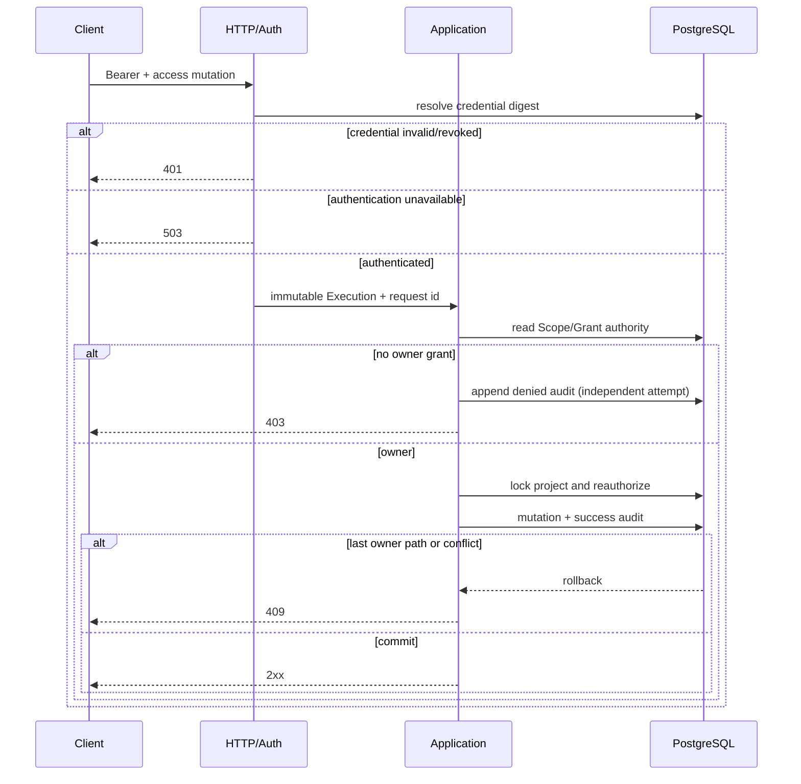

<!--
    Panvara
    docs/adr/0005-project-local-access-administration.md    2026-07-19
     ______     __  __     ______     ______     __     __
    /\  ___\   /\ \_\ \   /\  ___\   /\___  \   /\ \  _ \ \
    \ \___  \  \ \  __ \  \ \  __\   \/_/  /__  \ \ \/ ".\ \
     \/\_____\  \ \_\ \_\  \ \_____\   /\_____\  \ \__/".~\_\
      \/_____/   \/_/\/_/   \/_____/   \/_____/   \/_/   \/_/.com

    @link    : https://github.com/shezw/panvara
    @author  : shezw
    @email   : hello@shezw.com
-->

# ADR-0005：Project-local Principal、Credential 与 Grant 管理

- 状态：Accepted（P0-01b runnable slice）
- 日期：2026-07-19
- 关联：[ADR-0004](0004-persistent-execution-scope-access-kernel.md)、[访问管理指南](../modules/access-administration.md)

## 上下文

P0-01a 已把 Project、默认 Environment、`bootstrap-admin` Principal 与 `project.owner` Grant 持久化，并把 Record、Revision、Draft 授权收口到 Application 层。但管理认证仍只有启动 Token，缺少可管理的 Service Principal、持久化 Credential 生命周期与 Grant API；Token 轮换只能替换进程配置，无法表达明确撤销，也没有保护最后一个可用 Owner 路径。

Panvara 的目标用户是个人与中小开发团队。当前合理部署仍是模块化单体 + PostgreSQL，而不是先引入全局身份平台、独立授权服务、跨区域密钥基础设施或分布式一致性协议。与此同时，认证根、终态与授权事务必须足够明确，避免短期 bootstrap 行为固化为长期安全漏洞。

## 目标

- 在一个 Project/默认 Environment 内管理 Service Principal、API Credential 和固定 `project.owner` Grant。
- 所有新旧 Admin 用例统一由 `Credential → Principal → Grant` 授权，不信任请求或 Provider 自报 Role。
- 原始 Token 只在签发成功响应出现一次；持久化层只保存 SHA-256 digest 与非敏感 hint。
- 首启注册可幂等重启但不可被配置替换；Principal disable 与 Credential revoke 终态不可恢复，Grant 只能经已授权的显式 PUT 重新授予。
- 管理 mutation 在事务内重新授权，并与最小成功安全审计原子提交；阻止删除最后一个可用 Owner 路径。
- 保留未来 Account/ExternalIdentity/Session/Membership 与多 Environment 演进位置，不把 P0-01b 误称为完整 P0-01。

## 约束

- 当前一个 Server 进程只装配一个 Project 和一个默认 Environment。
- Record、Revision、Draft 等既有事实仍没有完整 `environment_id` 隔离。
- 当前只有 `project.owner`；没有动态 Role/Policy、RecordOwner 或字段/动作级策略。
- HTTP、Application 与 PostgreSQL 必须 fail closed；权威认证或授权读取不可用时返回 503，而不是降级信任缓存或调用方声明。
- P0-05 的通用 Audit/Idempotency/Outbox 尚未落地，本 ADR 只能定义最小访问安全审计。

## 备选方案

### A. 继续使用单个进程内 bootstrap Token

适用条件：一次性原型，没有 Credential 撤销、机器调用者和轮换要求。

风险与成本：共享 Secret 无法归属调用者；替换配置等同不透明轮换；无法显式撤销单个调用路径；重启行为与数据库授权事实分裂。退出方案是迁移到本 ADR 的持久化 Credential 与 marker。

### B. 直接引入外部 IAM/云授权服务

适用条件：已有组织级身份平台、明确的多应用联合登录与独立安全团队。

风险与成本：把 Provider 可用性、租户模型和厂商 Role 语义引入当前最小 Server；增加本地开发、离线验收和迁移复杂度；仍不能替代 Project-local Grant。退出方案需要保持本地 Principal/Grant 映射层，但当前阶段收益不足。

### C. 在模块化单体内持久化 Project-local Principal/Credential/Grant

适用条件：当前中小开发者、单 Server + PostgreSQL 场景，需要明确的机器身份轮换与撤销。

风险与成本：每次 Admin 授权读取权威数据库；Credential 与 Grant API 仍很窄；后续完整身份系统需要在保持 Principal/Execution 契约的前提下扩展。退出方案是通过 Application Port 把认证或访问模块拆为独立服务，数据库事实可渐进迁移而无需改变调用方自报 Role 的禁止规则。

## 决策

选择方案 C。

### 身份与授权链

P0-01b 增加 Project-local `Principal`：固定 bootstrap Principal 和可创建的 Service Principal。`Credential` 精确绑定 Project、Environment 与 Principal；`Grant` 精确绑定相同 Scope 与 `project.owner`。HTTP 只解析 Bearer；Application 产生的 `AuthenticatedPrincipal` 同时封装 Credential 证明的精确 Project + Environment Scope、Principal 与 Credential ID，`NewAdminExecution` 拒绝与其 Scope 不同的输入，再以 active Principal 与 active Grant 构造授权决定。

所有现有与新增 Admin 用例都使用同一链路。外部身份未来必须按以下顺序进入：

```text
ExternalIdentityVerifier
  → Account / ExternalIdentity / Session
  → ProjectMembership
  → project-local Principal
  → Execution
```

Google、Apple、Facebook、微信等 Provider 返回的 Role 或 Email 绝不直接映射 Grant；External Identity 也不得仅按 Email 自动合并。

### Credential 与 bootstrap

- 首启 Token 长度至少 32 字节、至多 1024 字节，只含 HTTP Bearer 安全 ASCII（字母、数字、`-._~+/`，`=` 只能尾随），且不得以保留前缀 `pvk1.` 开头；该前缀只属于签发的 Service Credential，避免 bootstrap selector 歧义。Application 计算 SHA-256；原始值不进入 Repository Port。
- PostgreSQL 原子写入 bootstrap Credential、digest/hint、永久 marker 与一次成功审计。marker 按 Project + Environment 唯一且 append-only。
- marker 不存在且省略 Token时拒绝启动；marker 存在后可省略 Token，相同 Token 可启动，不同 digest 返回冲突。
- marker 关联的 Credential 即使 revoked 也不会被重启复活、替换或重新签发。
- 普通签发 Token 使用 `pvk1.<credential-id>.<32-byte-secret>` 结构，只有成功 HTTP 响应返回一次；列表、日志、审计与数据库只包含 metadata/hint，不返回 digest。
- 轮换必须显式执行 `issue → verify → revoke`。Server 不自动撤销旧 Credential。

### 终态与最后路径

Principal `disabled` 与 Credential `revoked` 是终态，重复 transition 返回冲突且不能恢复。Grant 可以被撤销，也可以由另一个仍有 Owner 权限的 active Credential 通过显式 PUT 进入新的 active 周期；该 mutation 追加成功安全审计。restart/bootstrap 永不自动补回 missing/revoked Grant。

停用 Principal、撤销 Credential 或撤销 Grant 的事务必须在 mutation 后、提交前确认仍至少存在一个 active Principal + active Credential + active `project.owner` Grant 组合；否则回滚并返回 `last_owner_path`。这不是“至少一个 Owner Grant”计数，而是至少一个真实可认证和可授权的路径。

### 事务、审计与失败路径



每个访问 mutation 在 Project advisory transaction lock 下重新检查精确调用 Credential 和 Owner Grant，避免初次授权后状态变化造成 TOCTOU。成功 mutation 与 success audit 同事务提交或一起回滚。已认证授权拒绝使用独立、限时的 append-only denied audit；它不与已回滚业务事务声称原子。未认证请求不写依赖可信 Actor/Credential 外键的安全审计。

HTTP 固定映射：认证失败 401；认证成功但无 Grant/Scope inactive 403；权威访问状态不可用 503；最后 Owner path、重复终态或生命周期冲突 409。接口统一 `private, no-store`，签发响应另加 `Pragma: no-cache`。

## 接口契约

- `GET/POST /api/admin/core/v1alpha1/access/principals`
- `POST /api/admin/core/v1alpha1/access/principals/{principal}/disable`
- `GET/POST /api/admin/core/v1alpha1/access/principals/{principal}/credentials`
- `POST /api/admin/core/v1alpha1/access/credentials/{credential}/revoke`
- `GET /api/admin/core/v1alpha1/access/principals/{principal}/grants`
- `PUT/DELETE /api/admin/core/v1alpha1/access/principals/{principal}/grants/project.owner`

接口不接受查询参数。创建 Principal 和签发 Credential 使用严格 JSON，字段名按精确 ASCII 契约匹配，不做大小写或 Unicode 折叠；其他 mutation 使用空 Body。POST 创建返回 201，生命周期 mutation 返回 200。

## 数据与安全边界

Migration `0005_project_access_administration.sql` 扩展 Principal/Grant，新增 API Credential、bootstrap marker 和 security audit event。marker 与 audit event 由数据库 trigger 拒绝 UPDATE/DELETE。每个事实都含精确 Project/Environment 外键；Credential digest 是认证权威，hint 只用于人工识别，不能用于验证。

安全边界位于服务端 Application + PostgreSQL 事务，不在 Manager、反向代理、客户端 SDK 或 Provider。若未来拆服务，调用方仍只能传认证材料与业务意图；目标服务必须重新读取权威 Credential/Grant 并执行同样的事务不变量。

## 取舍与后果

正向后果：

- bootstrap 重启不再依赖进程内 digest，且配置无法静默替换认证根。
- 不同 Service Principal 可以独立签发、验证、轮换和撤销 Credential。
- last-owner path 和事务内二次授权避免常见自锁与竞态。
- 通过 Project-local Principal 保留未来人类身份和 Provider 接入边界。

代价与剩余风险：

- 权威数据库成为 Admin 认证/授权依赖；不可用时 Admin 返回 503。
- raw Token 的一次性响应仍要求客户端正确接入 Secret Store；Server 无法补发丢失 Token。
- append-only 最小安全审计没有查询 API、保留策略、通用幂等或 Outbox，不能满足完整 P0-05。
- 只有固定 Owner Role 和默认 Environment，不能表达完整组织权限与多环境事实隔离。

## 迁移与回滚

1. 先应用 `0005`，保留 P0-01a 的 Project/Environment/Principal/Grant 身份。
2. 对 marker 尚不存在的 Project，在下一次 Server 启动提供 32–1024 字节、仅含 Bearer 安全 ASCII且不以 `pvk1.` 开头的 Token；若旧值不满足字符集或使用保留前缀，只能在 marker 创建前替换。Credential、marker 与 bootstrap audit 原子创建。
3. marker 创建后，后续启动可省略 Token；在确认 Service Principal 新路径可用前保留 bootstrap Credential。
4. 轮换按 issue → verify → explicit revoke；任何失败都保留最后已验证路径。
5. Principal/Credential 终态和 marker 不回滚为 active；Grant 只接受已授权显式 PUT，不由回退或重启自动恢复。版本回退若不能理解 `0005`，必须先停止写入并恢复数据库备份；不得 DROP 表或手工清除 marker 来伪造回滚。

## 明确非目标

- 完整 P0-01：Account、ExternalIdentity、Session、ProjectMembership、dynamic role/policy、RecordOwner、真正多 Environment 事实隔离仍缺失。
- P0-05：本 ADR 不提供通用 Audit、Idempotency 或 Transactional Outbox。
- 全球身份基础设施：Google/Apple/Facebook/微信只定义未来验证与映射边界，当前没有 Provider 登录实现。
- 全球分布式部署：不增加跨区强一致、密钥分发、服务网格或独立 IAM 服务；仍以中小开发者的模块化单体为默认形态。
