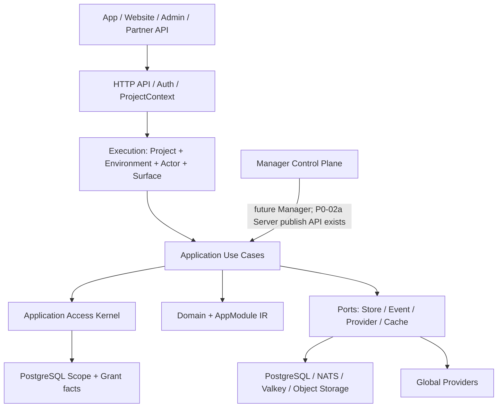
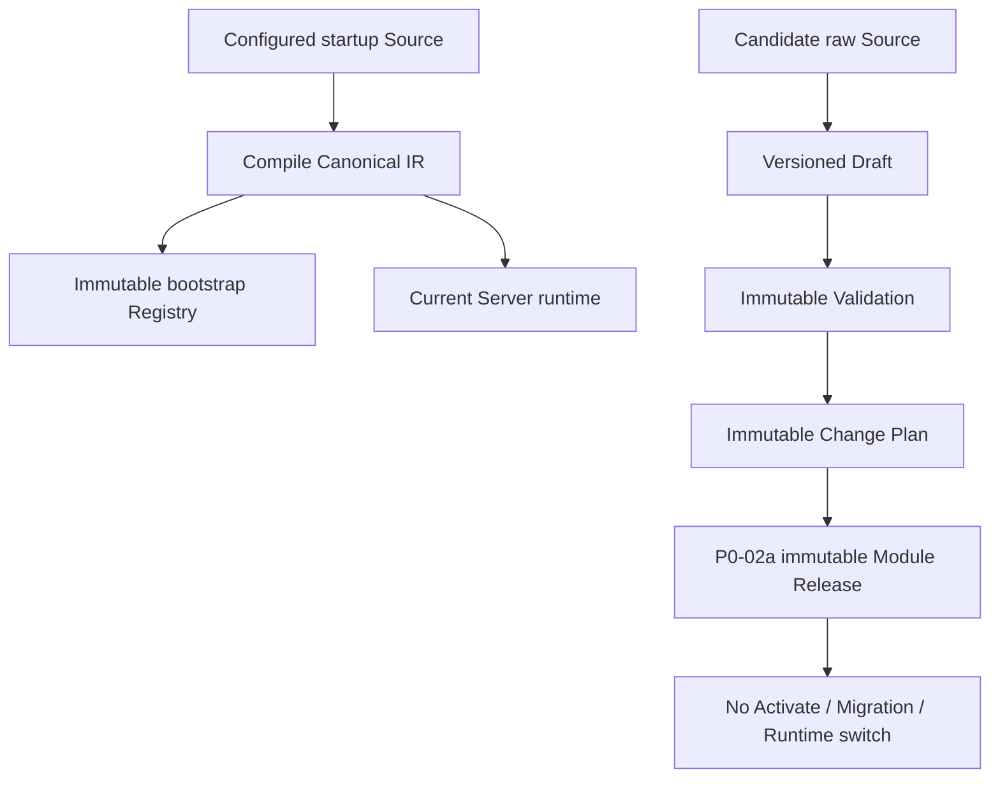
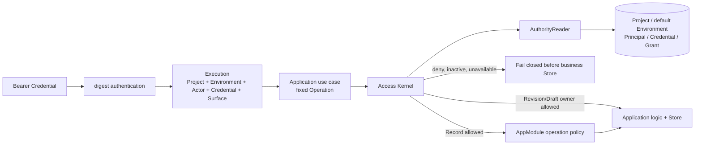

<!--
    Panvara
    docs/arch.md    2026-07-18
     ______     __  __     ______     ______     __     __
    /\  ___\   /\ \_\ \   /\  ___\   /\___  \   /\ \  _ \ \
    \ \___  \  \ \  __ \  \ \  __\   \/_/  /__  \ \ \/ ".\ \
     \/\_____\  \ \_\ \_\  \ \_____\   /\_____\  \ \__/".~\_\
      \/_____/   \/_/\/_/   \/_____/   \/_____/   \/_/   \/_/.com

    @link    : https://github.com/shezw/panvara
    @author  : shezw
    @email   : hello@shezw.com
-->

# Panvara 总体架构

## 1. 定位与约束

Panvara 是一套数据模型驱动、可组合、面向全球第三方生态的 Go 全栈框架。目标用户是个人与中小开发团队；它可以从精简 Server 起步，按项目需要增加 Manager、Website、Assets、Commerce 与独立 Worker。

这里的“全球化”首先是产品能力和 Provider 覆盖，不是首版建设跨洲强一致基础设施。首阶段的明确边界是：

- 单区域内从单机扩展到数百台内网服务器。
- 从数千并发逐步扩展到十万、百万并发；容量必须由基准和压测证明，架构不预先承诺固定数字。
- 远距离区域作为独立 Partition，暂不提供跨区强一致写入。
- 默认单 Project、一个持久化默认 Environment 部署；当前既有业务事实仍没有 `environment_id`，多项目托管与多 Environment 数据隔离都是后续能力，不让首版背负完整 SaaS 多租户复杂度。

## 2. 架构判断

Panvara 采用“模块化单体优先、按运行角色拆分”的方式，而不是把每张表和每个领域对象形式化地拆成微服务。

代码依赖以消费方定义的 Port 为中心：

    interfaces ----> application ----> domain
    infrastructure -> application
    bootstrap ------> interfaces + infrastructure

- Domain 是纯 Go 规则，不依赖数据库、HTTP、消息中间件和 Provider SDK。
- Application 编排用例和事务，通过 Port 接口请求外部能力。
- Interfaces 负责 HTTP、CLI、未来的 gRPC 和 Manager 接口。
- Infrastructure 实现由 Application 消费方定义的 Store/Provider Port，因此可以依赖 Application 契约和 Domain 值类型；Application/Domain 不能反向依赖 Infrastructure。
- Bootstrap 根据 Profile 显式装配实现；禁止隐藏式全局依赖和 Service Locator。

## 3. 可组合运行 Profile

| Preset | 适用场景 | 运行角色 / 业务能力 | 当前交付状态 | 外部依赖 |
| --- | --- | --- | --- | --- |
| Lite | Core 启动与运维验证 | all-in-one / Core lifecycle；AppModule 仅模型库 | 可运行基础切片 | 无 |
| Server | 通用 App 后端 | server / AppModule | 可运行最小纵向切片；Server Core 未完成 | PostgreSQL |
| Manager | 需要管理后台 | server + manager / AppModule | 规划中；无 Web 应用 | PostgreSQL |
| Site | 内容站与网站 | server / AppModule + Site + Assets | 规划中 | PostgreSQL；对象存储可选 |
| Commerce | 商城或付费产品 | server / AppModule + Commerce + Payments | 规划中 | PostgreSQL；缓存可选 |
| Distributed | 分离 API 和 Worker | server + worker / 可配置业务能力 | 规划中 | PostgreSQL；NATS 可选 |

Preset 是常用组合，不是继承树：Site 不强制 Manager，Commerce 不强制 Site，Headless 场景是一等公民。实现上把运行角色与业务 Feature 分开配置；只有当负载、隔离、安全或发布节奏确有差异时才拆进程。alpha.2 只为 Lite 与 Server 提供可执行装配路径；这表示“能够启动”，不表示对应产品范围开发完成。Manager、Site、Commerce 和 Distributed 尚无可运行装配并 fail fast。

## 4. 数据模型驱动模块

动态模块不以“上传任意代码”为目标，而以受控声明生成能力。当前开发分支把“启动运行事实”和“候选变化准备”分成两条不会互相越界的链路：

alpha.2 的 AppModule v1alpha1 已表达：

- Resource、Field、reference、唯一/引用索引与基础约束。
- Public Create、Admin CRUD、等值过滤、字段写入白名单和 bootstrap owner 边界。
- Manager 表单和列表的 UI Schema。
- 模块依赖、能力声明、冲突和版本约束。

alpha.3b 已把 Draft、Validation 与 Change Plan 作为 Server 内的项目 owner 控制面用例落地，但它们本身不进入 Registry 或 Runtime。P0-02a 进一步允许显式 Publish：复验计划与 Source，幂等登记 Candidate，并创建 environment-scoped、不可变 Module Release。动态排序、角色/所有者策略扩展、受控 Action/Event、完整审计、Activate/Rollback 仍是后续目标。

alpha.2 的 `requires.capabilities` 只进入 Canonical IR 与 Revision Hash；Bootstrap 不解析 Capability，也不会让缺失 Capability 影响 readiness 或 Runtime 行为。

模块依赖与 Capability 依赖是两种不同关系：前者形成确定的模块拓扑，后者由 Bootstrap 从本地模块或 Provider Adapter 中解析。字段/Resource、模块名和 Capability 分别使用独立命名规则，避免把 JSON Path、SQL 映射和协议命名混为一谈。

alpha.2 已把作者输入和 Canonical Domain 分离：

    spec/appmodule/v1alpha1 DTO + decoder
                    -> application compiler
                    -> domain/appmodule canonical model
                    -> immutable Module IR

未来旧 Spec 将通过 Converter 进入当前 Canonical Model；alpha.2 尚无旧版本 Converter，Domain 不携带 YAML 兼容分支。

明确禁止：

- 任意 Go、JavaScript、Shell 或 SQL。
- 模型直接持有 Provider 密钥。
- 绕过事务、权限、审计和资源限额的表达式。
- 在请求热路径修改数据库结构；alpha.2 只使用固定 flex migration。

alpha.3 采用 Draft → Validate → Plan → Publish → Activate 的阶段边界，并补齐审计与回滚。alpha.3a 增加启动时不可变登记；alpha.3b 完成前三个“准备变化”阶段：Draft 可保存语法或语义无效、但 UTF-8 编码合法且不含 NUL 的 Source，Validation 绑定精确 Draft Version，Plan 绑定有效 Validation 并解释相对固定 Baseline 的变化。P0-02a 的 Publish 只追加 Candidate Revision、Module Release、专用幂等绑定与安全审计，没有 active pointer、迁移或热切换；自然语言模型生成的候选声明也不能绕过这些确定性边界。详见 [ADR-0003](adr/0003-draft-validation-change-plan.md)与 [ADR-0006](adr/0006-immutable-module-release-publish-facts.md)。

完整 Module Revision、按 format 管理的 Data Schema Identity 与 Source Hash 是三类不同内容身份。Module Revision 是保存 Source、IR、生成物和首次 provenance 的不可变父制品；Data Schema Identity 是它下面的只追加派生身份。当前 format 1 只投影 Resource、Field、引用、enum 和数据约束，不包含 SemVer、标签、Manager、API、Capability 与依赖。未来新增算法会给同一父 Revision 追加新的 format，而不会改变父 Hash 或已有身份。当前 Record namespace 仍使用完整 Module Revision，Data Schema Identity 只是未来迁移规划的输入，详见 [ADR-0001](adr/0001-module-data-revision-identities.md)。

### 4.1 当前执行作用域与授权边界

P0-01a 在模块化单体内建立持久化执行作用域；P0-01b 的 migration `0005` 再加入 project-local Service Principal、digest-only API Credential、Owner Grant 管理、永久 bootstrap marker 与最小安全审计。某个 Project ID 首次装配时创建默认 Environment、`bootstrap-admin` 与精确 Owner Grant，并用首启 Token 原子登记 digest/hint + marker；之后 Token 可省略、相同可核对、不同值拒绝，revoked Credential 不会复活。新的 Project ID 与唯一 Key 会形成另一套隔离事实，但一个 Server 进程仍只装配一个 Project。

Record 5、Revision 3、Draft 8、Release Publish/Get 2 与 Access Administration 9 个固定 Operation 都在 Application 层调用同一个 Kernel。Public Surface 只能进入 Record Operation，Record 随后继续检查 AppModule Policy；Admin Surface 必须由 active Credential 认证 active Principal，并在 active 默认 Scope 内拥有 active Owner Grant。Actor/Provider 自报 Role、未知 Operation 和授权存储故障都不能放行。访问 mutation 与 Publish 在 PostgreSQL 事务内二次授权并写成功审计；Principal disable 与 Credential revoke 是终态，Grant 只允许另一个 Owner 显式重新授予，最后 Owner path 不能被移除。

这里的 Environment 是执行契约与授权查询的一部分，不是已完成的多 Environment 数据隔离。Module Release 已显式绑定默认 Environment，但 Draft、Revision 与 Record 仍主要是 project-scoped。完整 P0-01 仍需 Account、ExternalIdentity、Session、ProjectMembership、动态 Role/Policy、RecordOwner、既有事实的 Environment 归属，以及 Activate/Rollback、Migration、Provider、Job/Event 用例授权。P0-05 的通用 Audit/Idempotency/Outbox 也仍缺失；当前最小安全审计和 Release 专用幂等不能代替它。详见 [ADR-0004](adr/0004-persistent-execution-scope-access-kernel.md)、[ADR-0005](adr/0005-project-local-access-administration.md)与 [ADR-0006](adr/0006-immutable-module-release-publish-facts.md)。

## 5. 全球 Provider 体系

Core 面向 Capability 编程，第三方厂商只是 Adapter。Provider 协议独立版本化，并要求超时、幂等、重试分类、凭据引用、审计和健康检查。

| Capability | 标准优先 | 可选 Adapter 示例 |
| --- | --- | --- |
| Identity | OIDC / OAuth 2.x / WebAuthn | Google、Apple、Microsoft、Facebook、GitHub、微信 |
| Payment | PaymentIntent、Webhook、Refund 抽象 | Stripe、Adyen、PayPal、支付宝、微信支付；Apple Pay/Google Pay 作为钱包能力 |
| Email | 模板化发送与投递事件 | SMTP、Amazon SES、Postmark、SendGrid |
| SMS | 发送、状态回执、区域路由 | Twilio、区域供应商 |
| Push | 设备令牌和主题消息 | APNs、FCM |
| Object | S3 风格对象接口 | S3-compatible、Google Cloud Storage、Azure Blob |
| Media/CDN | 变换任务与公开资产 URL | 可插拔媒体与 CDN 服务 |

第三方列表是生态覆盖方向，不表示全部进入 Core。Core 只保留稳定 Capability；厂商 SDK 和变化快的字段留在 Adapter。

全球 Provider 还必须遵守：

- 每次新操作按 Project、国家/地区、币种、方法和 Capability 显式路由。
- 长期外部对象保存 Provider Instance、配置 Revision、Credential Version 与 External Reference。
- 支付处理中不得透明切换 Provider。
- 外部身份以 Issuer/Provider Instance + Subject 唯一定位，禁止按 Email 自动合并。
- Google、Apple、Facebook、微信等身份必须经 `ExternalIdentityVerifier → Account/ExternalIdentity/Session → ProjectMembership → project-local Principal → Execution`；Provider Role/Email 绝不直接映射 Grant。

## 6. 分布式管理

alpha.3a/3b 已建立 Registry 与 Draft/Validation/Plan；P0-01a/P0-01b 又增加默认 Environment Scope、Credential-backed Access Kernel 与 project-local 访问管理；P0-02a 增加不可变 Publish Facts。它们通过 Application Port 保留未来拆分边界，但不会为了当前中小开发者场景先增加独立服务。以下激活状态与分布式收敛仍是后续目标，不是当前能力：

- 数据面：无状态 API 节点和可水平扩展 Worker；请求显式携带 ProjectContext。
- 控制面：Manager 管理模型、配置、Provider 引用和发布；产出不可变 Revision。
- PostgreSQL：业务事实、发布记录、审计和 Outbox 的权威存储。
- PostgreSQL Outbox + SKIP LOCKED：首个 Server/Worker 拆分方案，避免过早增加中间件。
- NATS JetStream：需要多消费者、回放或经压测证明 PostgreSQL 队列不足时加入；消息只是事实副本，不替代数据库事务。
- Valkey：可丢失缓存、限流和短期协调；不是业务事实来源。
- 对象存储：资产和大对象；数据库只保存元数据与引用。

当前 Publish 先以短事务二次授权并解析已发布事实；未命中时，首次发布事务引用不可变 Validation/Plan、幂等登记 Revision，并写入 Module Release 与成功安全审计。两者都没有 Outbox。未来 Activate 流程再写入 active Snapshot/epoch 与 Outbox；Worker 分发激活提示，节点按哈希加载并上报状态。PostgreSQL Registry 与 Release 始终是制品/发布事实权威，但当前没有活动版本。消息丢失时节点轮询收敛仍是后续设计。

每次发布生成不可变 ProjectReleaseSnapshot、单调 epoch 和 Module Hash Map。节点先下载、校验并 ACK prepared，控制面再原子提升 active epoch；请求、Job 和 Event 开始时固定 epoch，处理中不得切换。未追平目标 Project 的节点不得承接该 Project 流量；失败发布保持 last-known-good，不改变 active epoch。

单区容量扩大时优先做无状态扩容、读写路径分析、缓存和队列削峰，再考虑领域拆库。

## 7. 微服务拆分准则

只有满足下列一个或多个条件才拆独立服务：

- 负载模型明显不同，例如 HTTP 短请求与媒体转码长任务。
- 安全边界不同，例如支付 Webhook 与普通内容服务。
- 故障隔离或资源隔离有明确收益。
- 团队所有权和发布节奏已经独立。
- 数据所有权可以清晰定义，不靠跨服务同步事务维持。

建议的演进顺序：

1. 单进程 Lite。
2. Server + PostgreSQL。
3. Server + Manager；静态资源走对象存储/CDN。
4. API 与 Worker 分离，通过 Outbox 和消息交接。
5. Commerce、Media 等高差异领域独立部署。
6. 数百节点时加入集中配置发布、分区路由、容量治理和故障演练。

不建议首期引入服务网格、跨区共识、每模块独立数据库或 Kubernetes Operator。这些能力可以保留接口位置，但必须由真实规模触发。

## 8. 数据与全球化原语

- ID：ProjectID 使用 UUIDv7，ProjectKey/Slug 单独建模；业务记录使用 UUIDv7 或等价的全局有序标识，不对外暴露数据库自增主键。
- 时间：持久化 UTC 时间点，展示与日历计算使用 IANA Time Zone；拒绝随宿主机变化的 Local。
- Locale：使用 BCP 47 标签；文案、格式和业务数据翻译分开建模。
- Currency：ISO 4217 风格代码；金额使用 int64 最小货币单位，不使用浮点。
- Country/Region：使用稳定代码和可更新目录，不把政治或税务规则硬编码进 Core。
- 删除与审计：业务删除、保留策略和不可变审计事件分开表达。

截至 alpha.2，Locale 和 Currency 仍只做结构校验。v0.1 前要接入标准 BCP 47 Parser、可版本化 ISO 4217 Catalog 与 minor-unit exponent；发行物已经嵌入 Go 的 IANA 时区数据。

## 9. 当前落地与后续

v0.1.0-alpha.2 已落地严格 AppModule、Canonical IR/Hash、OpenAPI/UI Schema、flex Store、CRUD、Lite/Server 与 PostgreSQL 门禁。当前开发分支继续落地 alpha.3a/3b、P0-01a/P0-01b 以及 P0-02a 的持久化 Scope、Service Principal/API Credential/Owner Grant、marker、安全审计、Application Access Kernel 与不可变 Publish Facts。Distribution 仍保持 alpha.2。

Server 每次启动仍从配置的 Source 计算当前 Revision；migration 后先创建或核对持久化默认 Scope，再在 readiness 前幂等登记 Revision。Scope 初始化、Registry 登记和 P0-02a Publish 都不等于激活，Draft/Validation/Plan/Publish 不会改变这条启动链路。任何 Canonical IR 变化仍会形成全新的空数据命名空间；旧 Revision 的 Record、唯一值和引用完整保留且按 Revision 隔离，不迁移、不重绑。Registry List 与 Release 时间都不表达当前运行版本，当前值只能从 OpenAPI 的 `x-panvara-revision` 读取。Activate/Migration 完成前，变更前仍须备份数据库；覆盖启动 Source 不是升级。

alpha.3 必须通过后续 ADR 定案迁移与激活协议：迁移任务显式且幂等，保留 `record_id`，在目标 namespace 重建 unique/reference 约束，校验成功后原子 Activate，失败或回滚继续使用旧 namespace；同时决定按 format 选择的 Data Schema Identity 如何参与 Record namespace 与迁移兼容判断。

P0-01b 已把现有与访问管理 Admin 用例统一为 Credential-backed Application 授权。完整 P0-01 仍需 Account/ExternalIdentity/Session/ProjectMembership、RecordOwner、动态策略与真正多 Environment 事实；未来 Release、Migration、Provider、Job/Event 用例必须接入同一 Kernel，不能把当前 runnable slice 误写成全面授权完成。

alpha.3 还必须验证业务写入与 Outbox 同事务、ProjectReleaseSnapshot + epoch 固定执行版本，并评估超过当前 512 字节唯一值边界时是否采用 Hash 索引加原值碰撞复核；这些都不是 alpha.2 已实现能力。

尚未落地完整 P0-01、多 Environment 数据隔离、动态排序、Activate/Rollback、数据迁移执行、完整 Manager 应用、Outbox/Worker、Provider Runtime 和分布式进程。Publish 当前仅完成 P0-02a 不可变事实切片。这些按 [Server Core 能力清单](roadmap/server-core.md) 逐步进入，而不是提前创建空实现；Manager 的全部页面、Server 前置契约与逐阶段验收见 [Manager 范围与验收](roadmap/manager.md)。

当前代码事实与未来方案分开记录：[当前 Server 架构事实](architecture-review-server-current.md) 只陈述已经存在的实现，[Server Core 能力清单](roadmap/server-core.md) 与 [Manager 范围与验收](roadmap/manager.md) 才是后续待办。

开发和质量基线分别见 [开发环境](development.md) 与 [验证测试框架](testing.md)。
