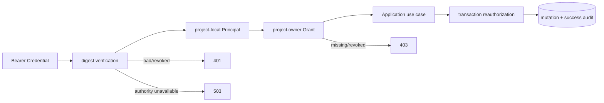

<!--
    Panvara
    docs/modules/access-administration.md    2026-07-19
     ______     __  __     ______     ______     __     __
    /\  ___\   /\ \_\ \   /\  ___\   /\___  \   /\ \  _ \ \
    \ \___  \  \ \  __ \  \ \  __\   \/_/  /__  \ \ \/ ".\ \
     \/\_____\  \ \_\ \_\  \ \_____\   /\_____\  \ \__/".~\_\
      \/_____/   \/_/\/_/   \/_____/   \/_____/   \/_/   \/_/.com

    @link    : https://github.com/shezw/panvara
    @author  : shezw
    @email   : hello@shezw.com
-->

# Project-local 访问管理指南

## 用途

访问管理模块让 Project Owner 在当前 Project/默认 Environment 内管理 Service Principal、API Credential 和固定的 `project.owner` Grant。它解决的是机器调用者的最小生命周期：创建身份、一次性签发凭据、授予权限、轮换并显式撤销旧凭据，以及在不留下最后一个不可用管理入口的前提下停用访问。

P0-01b 的授权链路始终是 `Credential → Principal → Grant → Application use case`。认证结果 `AuthenticatedPrincipal` 同时绑定 Credential 证明的精确 Project + Environment Scope、Principal 与 Credential ID，不能拿到另一个 Environment 构造 Admin Execution。Token 只完成认证；所有新旧 Admin 用例仍由 active Principal、active Credential 和未撤销 `project.owner` Grant 共同授权。请求、Provider 返回的 Role 或 Email 都不能直接生成 Grant。



## 当前状态

这是 **P0-01b runnable slice**，不是完整 P0-01 或通用 IAM。

当前已实现：

- 首次启动为 `bootstrap-admin` 写入一个 Credential 的 SHA-256 digest 与 `sha256:<12 hex>` hint，并永久写入初始化 marker；原始 Token 不入库。
- marker 不存在时，`PANVARA_ADMIN_TOKEN` 必须至少 32 字节、至多 1024 字节，只含 HTTP Bearer 安全 ASCII（字母、数字、`-._~+/`，`=` 只能尾随），且不得以保留前缀 `pvk1.` 开头；marker 已存在后可以省略 Token，提供相同 Token 也可启动，提供不同 Token 会拒绝启动。
- bootstrap Credential 即使已撤销也不会被启动流程复活、替换或重新签发；marker 与安全审计表由数据库触发器保护为 append-only。
- 创建/列出 Service Principal；列出/一次性签发/撤销 API Credential；查询/授予/撤销唯一固定 Role `project.owner`；终态停用 Principal。
- 每个管理 mutation 在同一 Project 事务锁内重新验证调用 Credential 与 Owner Grant，并把成功 mutation 与最小安全审计一同提交；已认证但授权失败会尝试追加独立 denied 审计。
- 停用 Principal、撤销 Credential 或撤销 Grant 前检查至少还存在一个“active Principal + active Credential + active Owner Grant”路径；否则返回 409 `last_owner_path`。Grant 可由仍有权限的 Owner 通过显式 PUT 重新授予，但启动/bootstrap 永不自动补回。

完整 P0-01 仍缺 Account、ExternalIdentity、Session、ProjectMembership、动态 Role/Policy、RecordOwner，以及 Record/Revision/Draft 等既有事实的真正多 Environment 归属。P0-05 的通用 Audit、Idempotency 和 Transactional Outbox 仍未完成；本切片的安全审计只覆盖访问管理成功 mutation、bootstrap 和已认证授权拒绝，不是通用业务审计系统。

## 前置条件

- 使用 `server` Profile与 PostgreSQL 18.4。
- 从仓库根目录执行 `make local-init`，并在每个终端加载 `.env` 与 `.env.local`。
- 首次初始化需要 `PANVARA_ADMIN_TOKEN`；`make local-init` 会生成 32 个随机字节的十六进制表示，并且不会覆盖已有 `.env.local`。
- 安装 `curl` 与 `jq`，Server 已由 `make run-server` 启动且 `/readyz` 返回 200。
- 以下命令只用于可丢弃的本地验收。不要开启 `set -x`，不要打印、提交或复制 Token 到聊天、Issue 与日志。

## 最小示例

在已加载配置的第二个终端创建 Service Principal，并把响应中的非敏感 ID 保存为变量：

```sh
BASE=http://127.0.0.1:8080

SERVICE_PRINCIPAL_ID="$(curl -fsS -X POST \
  "$BASE/api/admin/core/v1alpha1/access/principals" \
  -H "Authorization: Bearer $PANVARA_ADMIN_TOKEN" \
  -H 'Content-Type: application/json' \
  --data '{"display_name":"local deployment"}' \
  | jq -er '.id')"

printf 'created principal: %s\n' "$SERVICE_PRINCIPAL_ID"
```

签发 Credential 时，原始 `token` 只出现在这一次成功响应。先以仅当前用户可读的临时文件接收响应，只打印已脱敏元数据，再立即删除文件：

```sh
umask 077
ISSUE_RESPONSE="$(mktemp)"

curl -fsS -X POST \
  "$BASE/api/admin/core/v1alpha1/access/principals/$SERVICE_PRINCIPAL_ID/credentials" \
  -H "Authorization: Bearer $PANVARA_ADMIN_TOKEN" \
  -H 'Content-Type: application/json' \
  --data '{"label":"local acceptance"}' \
  >"$ISSUE_RESPONSE"

SERVICE_TOKEN="$(jq -er '.token' "$ISSUE_RESPONSE")"
SERVICE_CREDENTIAL_ID="$(jq -er '.credential.id' "$ISSUE_RESPONSE")"
jq '{credential}' "$ISSUE_RESPONSE"
rm -f "$ISSUE_RESPONSE"
unset ISSUE_RESPONSE
```

先授予 Owner Grant，再用新 Credential 验证管理读取。不要先撤销旧凭据：

```sh
curl -fsS -X PUT \
  "$BASE/api/admin/core/v1alpha1/access/principals/$SERVICE_PRINCIPAL_ID/grants/project.owner" \
  -H "Authorization: Bearer $PANVARA_ADMIN_TOKEN" \
  | jq -e '.active == true'

curl -fsS \
  "$BASE/api/admin/core/v1alpha1/access/principals" \
  -H "Authorization: Bearer $SERVICE_TOKEN" \
  | jq -e --arg id "$SERVICE_PRINCIPAL_ID" '.data | any(.id == $id)'
```

轮换的固定顺序是 `issue → verify → explicit revoke`：为同一 Principal 再签发一个新 Credential，用新 Token 验证成功后，才对旧 Credential 调用 revoke。Server 不会自动撤销旧 Token。

## 配置

| 配置或契约 | 当前值 | 安全与生命周期语义 |
| --- | --- | --- |
| `PANVARA_ADMIN_TOKEN` | 首启必需；32–1024 字节、仅 Bearer 安全 ASCII、不得以 `pvk1.` 开头 | 首启只持久化 digest + hint；marker 存在后可省略，相同值可用，不同值拒绝启动 |
| bootstrap marker | 每个 `(project_id, environment_id)` 一条 | 永久且 append-only；Credential 被撤销后仍保留，启动不得复活 |
| 新签发 Token | `pvk1.<credential-uuidv7>.<32-byte-base64url>` | 只在成功的 201 响应返回一次；数据库只保存 SHA-256 digest 与 hint |
| Principal | `bootstrap` 或 `service`；`active`/`disabled` | `disabled` 是终态，不能恢复；Service ID 形如 `svc:<uuidv7>` |
| Credential | `active`/`revoked` | `revoked` 是终态，不能恢复或重新签发相同 Credential |
| Grant | 仅 `project.owner`，精确绑定 Project + Environment + Principal | DELETE 撤销；仍有权限的 Owner 可显式 PUT 重新授予，restart/bootstrap 永不自动恢复 |
| HTTP 缓存 | `Cache-Control: private, no-store` | 签发响应另带 `Pragma: no-cache`；客户端仍必须避免记录响应 Body |

访问管理 API 不接受查询参数。Create Principal Body 只接受精确 ASCII 字段名 `display_name`；Issue Credential Body 只接受精确 ASCII 字段名 `label`，字段名不做大小写或 Unicode 折叠；未知或重复 JSON 字段、多个 JSON 值都会返回 400。其余 mutation 要求空 Body。

| 方法 | 路径 | 成功状态与结果 |
| --- | --- | --- |
| GET / POST | `/api/admin/core/v1alpha1/access/principals` | 200 列表 / 201 创建 Service Principal |
| POST | `/api/admin/core/v1alpha1/access/principals/{principal}/disable` | 200，返回 terminal `disabled` Principal |
| GET / POST | `/api/admin/core/v1alpha1/access/principals/{principal}/credentials` | 200 非敏感列表 / 201 一次性 Token |
| POST | `/api/admin/core/v1alpha1/access/credentials/{credential}/revoke` | 200，返回 terminal `revoked` Credential |
| GET | `/api/admin/core/v1alpha1/access/principals/{principal}/grants` | 200，只返回该 Principal 的 Owner Grant 生命周期视图 |
| PUT / DELETE | `/api/admin/core/v1alpha1/access/principals/{principal}/grants/project.owner` | 200 显式授予 / 200 撤销；另一 Owner 可再次显式 PUT |

## 验收

完成“最小示例”后，按以下步骤验证轮换、终态与 last-owner 防护；全过程不要输出 `$PANVARA_ADMIN_TOKEN` 或 `$SERVICE_TOKEN`。

1. 列出 Credential，只能看到 metadata 与 `hint`，不能出现 `token` 或 digest：

```sh
curl -fsS \
  "$BASE/api/admin/core/v1alpha1/access/principals/$SERVICE_PRINCIPAL_ID/credentials" \
  -H "Authorization: Bearer $SERVICE_TOKEN" \
  | jq -e 'all(.data[]; has("token") | not)'
```

2. 签发第二个 Credential，验证后撤销第一个：

```sh
umask 077
ROTATE_RESPONSE="$(mktemp)"
curl -fsS -X POST \
  "$BASE/api/admin/core/v1alpha1/access/principals/$SERVICE_PRINCIPAL_ID/credentials" \
  -H "Authorization: Bearer $SERVICE_TOKEN" \
  -H 'Content-Type: application/json' \
  --data '{"label":"local acceptance rotated"}' \
  >"$ROTATE_RESPONSE"

ROTATED_TOKEN="$(jq -er '.token' "$ROTATE_RESPONSE")"
ROTATED_CREDENTIAL_ID="$(jq -er '.credential.id' "$ROTATE_RESPONSE")"
rm -f "$ROTATE_RESPONSE"
unset ROTATE_RESPONSE

curl -fsS \
  "$BASE/api/admin/core/v1alpha1/access/principals" \
  -H "Authorization: Bearer $ROTATED_TOKEN" \
  | jq -e '.data | length >= 2'

curl -fsS -X POST \
  "$BASE/api/admin/core/v1alpha1/access/credentials/$SERVICE_CREDENTIAL_ID/revoke" \
  -H "Authorization: Bearer $ROTATED_TOKEN" \
  | jq -e '.status == "revoked"'

STATUS="$(curl -sS -o /dev/null -w '%{http_code}' \
  "$BASE/api/admin/core/v1alpha1/access/principals" \
  -H "Authorization: Bearer $SERVICE_TOKEN")"
test "$STATUS" = 401
unset SERVICE_TOKEN
```

3. 在 bootstrap path 仍可用时撤销 Service Principal 的 Grant；随后同一 Token 认证可通过，但 Admin 授权返回 403。用 bootstrap Owner 显式 PUT 重新授予并再次验证，不依赖 restart：

```sh
curl -fsS -X DELETE \
  "$BASE/api/admin/core/v1alpha1/access/principals/$SERVICE_PRINCIPAL_ID/grants/project.owner" \
  -H "Authorization: Bearer $ROTATED_TOKEN" \
  | jq -e '.active == false'

STATUS="$(curl -sS -o /dev/null -w '%{http_code}' \
  "$BASE/api/admin/core/v1alpha1/access/principals" \
  -H "Authorization: Bearer $ROTATED_TOKEN")"
test "$STATUS" = 403

curl -fsS -X PUT \
  "$BASE/api/admin/core/v1alpha1/access/principals/$SERVICE_PRINCIPAL_ID/grants/project.owner" \
  -H "Authorization: Bearer $PANVARA_ADMIN_TOKEN" \
  | jq -e '.active == true'

curl -fsS \
  "$BASE/api/admin/core/v1alpha1/access/principals" \
  -H "Authorization: Bearer $ROTATED_TOKEN" \
  | jq -e '.data | length >= 2'
```

4. 验证 last-owner 防护：先用 Service Owner 显式撤销 bootstrap Grant，此时 Service 是唯一可用 path；再尝试撤销 Service Grant，应返回 409 `last_owner_path` 且事务回滚。最后用仍有效的 Service Owner 显式恢复 bootstrap Grant：

```sh
curl -fsS -X DELETE \
  "$BASE/api/admin/core/v1alpha1/access/principals/bootstrap-admin/grants/project.owner" \
  -H "Authorization: Bearer $ROTATED_TOKEN" \
  | jq -e '.active == false'

umask 077
LAST_OWNER_RESPONSE="$(mktemp)"
STATUS="$(curl -sS -o "$LAST_OWNER_RESPONSE" -w '%{http_code}' -X DELETE \
  "$BASE/api/admin/core/v1alpha1/access/principals/$SERVICE_PRINCIPAL_ID/grants/project.owner" \
  -H "Authorization: Bearer $ROTATED_TOKEN")"
test "$STATUS" = 409
jq -e '.code == "last_owner_path"' "$LAST_OWNER_RESPONSE"
rm -f "$LAST_OWNER_RESPONSE"
unset LAST_OWNER_RESPONSE

curl -fsS -X PUT \
  "$BASE/api/admin/core/v1alpha1/access/principals/bootstrap-admin/grants/project.owner" \
  -H "Authorization: Bearer $ROTATED_TOKEN" \
  | jq -e '.active == true'
```

5. 验证权威认证存储不可用时返回 503，而不是 401/403 或降级放行；随后恢复 PostgreSQL 并等待 readiness：

```sh
docker compose -f deploy/compose/compose.yaml stop postgres

STATUS="$(curl -sS -o /dev/null -w '%{http_code}' \
  "$BASE/api/admin/core/v1alpha1/access/principals" \
  -H "Authorization: Bearer $ROTATED_TOKEN")"
test "$STATUS" = 503

docker compose -f deploy/compose/compose.yaml start postgres
until curl -fsS "$BASE/readyz" >/dev/null; do sleep 1; done
```

6. 停止 Server，保留数据库并在启动 Server 的 Shell 中临时 `unset PANVARA_ADMIN_TOKEN` 后重启。marker 存在时应成功启动；若重新加载原值也应成功，提供不同值或 `pvk1.` 前缀 bootstrap 值应在监听 HTTP 前拒绝启动。restart 不会复活 revoked Credential，也不会自动补回 revoked/missing Grant。完成后清除验收 Shell 中的 Secret：

```sh
unset ROTATED_TOKEN PANVARA_ADMIN_TOKEN
```

成功标准：新 Credential 能授权，旧 Credential 撤销后为 401，缺 Grant 为 403，权威认证/授权存储不可用时为 503，最后 Owner path mutation 为 409；响应和终端输出中都没有原始 Token。停止 Server 使用 `Ctrl+C`，本地数据库使用 `make infra-down` 停止。

开发门禁：

```sh
make test-integration
make test-server-smoke
make docs-check
```

## 常见问题

### 401、403 和 503 分别表示什么？

401 表示 Bearer 缺失、格式错误、digest 不匹配、Credential 已撤销或 Principal 已停用；403 表示已认证 Principal 没有当前作用域的 active `project.owner` Grant，或作用域停用；503 表示认证/授权权威状态无法读取。客户端不能在 503 时降级放行。

### 为什么重启时可以不再提供 bootstrap Token？

永久 marker 已经证明这个 Project/Environment 完成过一次初始化。启动只核对 marker 与持久化 Credential，不需要明文 Token；若仍提供 Token，会按 digest 与 marker 做恒定时间比较，不同值直接冲突。

### 为什么 bootstrap Token 不能以 `pvk1.` 开头？

`pvk1.` 是 Panvara 一次性签发的 Service Credential 保留前缀，认证器会把它解析为带 Credential ID 的结构化 Token。bootstrap Token 使用该前缀会与 selector 语义冲突并可能锁死初始化，因此首启校验会直接拒绝。请使用 `make local-init` 生成无该前缀的随机值。

### 丢失 bootstrap Token 后可以改 `.env.local` 补一个吗？

不可以。marker 防止启动配置偷偷替换安全根。应使用仍可用的 Owner Credential 创建新 Service Principal/Credential/Grant；如果所有 Owner path 都已丢失，本切片没有自助恢复 API，需要走受控数据库恢复与审计流程。

### 已撤销的 Grant 怎样重新授予？

使用另一个仍有 Owner 权限的 active Credential 对同一路径显式 PUT。当前 Grant 会进入新的 active 周期，显式 re-grant 会追加成功安全审计；restart/bootstrap 永远不会自动恢复。只有 Credential revoke 与 Principal disable 是不可恢复终态。

### 可以把签发响应保存到 CI 日志吗？

不可以。签发响应是唯一一次返回原始 Token 的位置。CI 应把它直接写入 Secret Store 或权限受限的临时文件，输出时只保留 `credential` 元数据，并确保失败日志不会转储 Response Body。

## 当前限制

- 只有 Service Principal/API Credential 机器身份和固定 `project.owner` Role；没有人类 Account、ExternalIdentity、Session、MFA、邀请或 ProjectMembership。
- 没有 Credential Secret Manager、到期时间、自动轮换、列表分页、按名称查询或恢复端点；轮换必须显式 issue → verify → revoke。
- Grant 只有 `project.owner`，没有动态 Role/Policy、字段/动作级权限或 RecordOwner。
- 一个 Server 进程仍固定一个 Project 和默认 Environment；Record、Revision、Draft 事实未真正按 Environment 隔离。
- 最小安全审计没有公开查询 API、通用保留策略、幂等记录或 Outbox；因此 P0-05 仍未完成。
- 没有生产级恢复工作流、速率限制、TLS 终止、Secret Reference Runtime 或完整可观测性。

未来 Google、Apple、Facebook、微信等登录必须遵循：

`ExternalIdentityVerifier → Account/ExternalIdentity/Session → ProjectMembership → project-local Principal → Execution`。

Provider 返回的 Role 或 Email 绝不能直接映射 `Grant`，外部身份也不能只按 Email 自动合并。该路径属于完整 P0-01/P1 身份接入面，不是 P0-01b 已实现能力。

## 兼容与升级

Migration `0005_project_access_administration.sql` 扩展既有 Principal/Grant 事实，并新增 API Credential、永久 bootstrap marker 与最小 append-only security audit。升级既有数据库后，下一次启动需要一个 32–1024 字节、仅含 Bearer 安全 ASCII且不以 `pvk1.` 开头的 bootstrap Token 完成一次 marker 初始化；成功后后续启动可省略。若旧 `.env.local` 含不安全字符或使用保留前缀，必须在 marker 首次创建前生成新的合法值；marker 一旦存在就不能再改变。初始化失败不会留下 marker 或半个 Credential。

迁移不会为旧 Token 保存明文。初始化完成后，不得改变 `PANVARA_ADMIN_TOKEN` 来轮换；正式轮换必须通过 Credential API 执行 `issue → verify → explicit revoke`。Principal disabled 与 Credential revoked 不会被升级或重启恢复；Grant 只能由另一个已授权 Owner 显式 PUT 重新授予，升级、重启和 bootstrap 都不会自动补回。

P0-01b 保持模块化单体优先：Domain/Application/Infrastructure/HTTP 边界通过 Port 组合，适合中小开发团队以一个 Server + PostgreSQL 运行。未来只有在负载、安全、故障隔离或团队所有权提供证据时才拆服务；即使拆分，Credential、Grant、审计与 last-owner 不变量仍必须由权威服务端事务维护，并保留回迁/替换路径。
