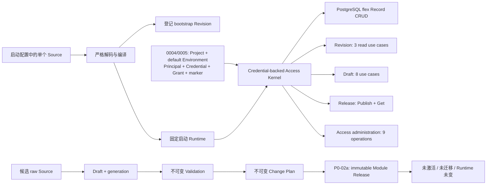
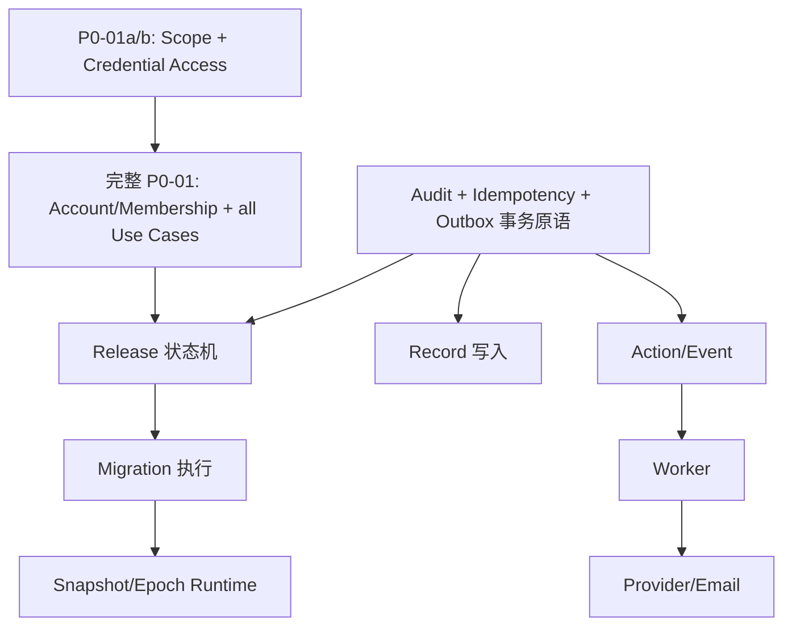
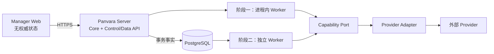

<!--
    Panvara
    docs/roadmap/server-core.md    2026-07-18
     ______     __  __     ______     ______     __     __
    /\  ___\   /\ \_\ \   /\  ___\   /\___  \   /\ \  _ \ \
    \ \___  \  \ \  __ \  \ \  __\   \/_/  /__  \ \ \/ ".\ \
     \/\_____\  \ \_\ \_\  \ \_____\   /\_____\  \ \__/".~\_\
      \/_____/   \/_/\/_/   \/_____/   \/_____/   \/_/   \/_/.com

    @link    : https://github.com/shezw/panvara
    @author  : shezw
    @email   : hello@shezw.com
-->

# Server Core 可执行路线图

::: danger 当前不是 Server Core 完成
当前代码只达到 **runnable-slice（可运行纵向切片）**：它证明了单 Project、单 AppModule 下的严格声明编译、固定 Revision JSONB CRUD、Registry、Draft → Validate → Plan，以及 P0-01a/P0-01b 的默认 Environment、Credential-backed Access Kernel 与 project-local 访问管理可以贯通。

完整 P0-01 仍未完成；当前没有 Account/ExternalIdentity/Session/ProjectMembership、动态 Role/Policy、RecordOwner、真正多 Environment 事实，也没有 Migration/Provider 用例授权。P0-05 的通用 Audit/Idempotency/Outbox 仍未完成；P0-01b 只有访问管理最小安全审计，P0-02a 只有 Release 专用幂等。Publish Facts 已存在，但 Activate、Rollback、数据迁移、Worker、Provider Runtime、活动版本恢复与多节点收敛仍不存在。任何状态页都不得把当前阶段标为“Server 开发完成”。
:::

本页定义 Server Core 的能力边界、成熟度术语、核心模型、分阶段待办和验收门禁。它是计划与完成口径，不会因为文档中列出了某项能力就自动表示该能力已经实现。

相关背景见[总体架构](../arch.md)、[Core v0 边界](../core-v0.md)、[不可变 Revision Registry](../adr/0002-immutable-revision-registry.md)、[Draft/Validation/Plan](../adr/0003-draft-validation-change-plan.md)、[持久化执行作用域](../adr/0004-persistent-execution-scope-access-kernel.md)、[Project-local 访问管理](../adr/0005-project-local-access-administration.md)和[不可变发布事实](../adr/0006-immutable-module-release-publish-facts.md)。

## 1. 当前真实基线

当前 Server 的启动与变更准备是两条彼此隔离的链路：



真实代码边界包括：

- `cmd/panvara/server_runtime.go` 只装配一个由启动配置定义并与数据库核对的 Project、一个持久化默认 Environment、一个编译后的 AppModule、一个 PostgreSQL Pool 和一个 HTTP Router。
- `db/migrations/0001_flex_record.sql` 只建立 Record、Unique 和 Reference 数据结构。
- `db/migrations/0002_module_revision_registry.sql` 建立不可变 bootstrap Revision 事实库，但没有发布或活动状态。
- `db/migrations/0003_module_draft_workflow.sql` 建立 Draft、Validation 和 Plan，但明确不执行迁移。
- `db/migrations/0004_project_environment_access.sql` 追加 Project、Environment、Principal 与固定 `project.owner` Grant；它不向 `0001`–`0003` 的事实表增加 `environment_id`。
- `db/migrations/0005_project_access_administration.sql` 追加 Service Principal/API Credential、permanent marker、Grant lifecycle 与最小 append-only security audit。
- `db/migrations/0006_module_publish_facts.sql` 追加 environment-scoped、append-only Module Release 与发布专用幂等绑定，并扩展受控 Revision publish provenance。
- `internal/application/access` 以 Credential-backed `Execution` 和持久化 Grant 授权 Record 5、Revision 3、Draft 8、Release 2 与访问管理 9 个 Operation；Record 随后继续执行 AppModule Operation Policy。
- Access Kernel 只接受 active 的默认 Environment。它阻断非默认 Environment，但不构成多 Environment 事实隔离。
- `internal/application/appmodule/manager_schema.go` 只生成前端可消费的 JSON 描述，不是 Manager 应用。

当前可确认的成果是“这条窄链路可以运行并被测试”，而不是“通用服务端的核心模型和基础能力已经齐备”。

## 2. 统一成熟度术语

所有模块、Profile 和发布说明必须使用下表术语。成熟度是逐级包含关系；高一级必须满足前一级的全部门禁。

| 成熟度 | 定义 | 最低证据 | 不能据此宣称 |
| --- | --- | --- | --- |
| `planned` | 只有方向、范围或占位定义，契约和失败语义尚未冻结 | 路线图、问题陈述、边界草案 | 可调用、可集成或可启动 |
| `contract-defined` | 领域事实、API/Port、状态机、不变量和验收已通过 ADR/Schema 定义 | 已接受 ADR、契约测试设计、迁移方案 | 实现已存在或真实依赖已经验证 |
| `runnable-slice` | 一条明确限制范围的纵向旅程可以执行并有自动化测试 | 真实入口、真实存储或明确替身、成功与关键失败用例 | 所属模块 feature-complete，更不能称 production-ready |
| `feature-complete` | 当前版本承诺范围内的功能、权限、故障路径、升级与文档全部实现，没有伪启动或空实现 | 完整契约测试、真实依赖 E2E、迁移和恢复测试 | 已完成容量、安全运营和生产加固 |
| `production-ready` | 已完成安全、可观测性、容量、备份恢复、N-1 升级、供应链、值班与运行手册验证 | 发布制品、压测/长稳/故障演练、SBOM/签名、恢复报告 | 已具备多节点一致发布和分布式故障收敛 |
| `distributed-ready` | 多 Server/Worker 节点能以 Snapshot + epoch 一致运行，并验证故障、重复、分区和扩缩容 | 多节点 E2E、prepared/ACK/activate、积压恢复、分区与故障演练 | 跨区域强一致或无限水平扩展 |

当前成熟度：

| 对象 | 当前成熟度 | 说明 |
| --- | --- | --- |
| Server Core | `runnable-slice` | 已验证单项目、单模块 CRUD 与变更准备链路 |
| P0-01a/P0-01b Project/Access | `runnable-slice` | 已完成默认 Environment、Service Credential/Grant 管理与现有/新增 Admin 用例授权；完整 P0-01/P0-05 未完成 |
| Worker Runtime | `planned` | 没有 Outbox、Job、Lease、Retry 或 Worker 进程 |
| Provider Runtime/Adapter | `planned` | Capability 目前只是声明字符串 |
| Manager 产品 | `planned` | UI Schema 生成器可运行，但 Manager Web 不存在 |
| Site/Commerce/Payments/Assets | `planned` | Profile/Feature 名称不是可运行实现 |

## 3. 组件边界与权威归属

Manager 不能成为所有后端缺口的容器。每种能力必须只有一个权威所有者。

| 边界 | 必须负责 | 明确不负责 | 权威状态位置 |
| --- | --- | --- | --- |
| Server Core | Project 隔离、身份与授权、AppModule 编译、Release、Migration、Record 规则、审计、幂等、Outbox、控制面与数据面 API | 厂商 SDK、页面交互、长时间外部副作用执行 | PostgreSQL 中的领域事实与不可变制品 |
| Worker | 从持久化 Job/Outbox 领取任务、Lease、重试、Dead Letter、调用 Capability Port、回写结果 | 发布决策、权限策略、活动版本选择、直接解释 Manager 页面状态 | Server 提交的 Job/Outbox 与执行事实 |
| Adapter | 把稳定 Capability 契约转换成 SMTP、OIDC、支付、对象存储等外部协议；执行超时、错误分类和脱敏 | 业务状态机、Project 权限、发布与迁移决策 | Provider 外部系统；Core 只保存引用和回执 |
| Manager | 登录交互、导航、Schema 渲染、Draft 编辑、Plan/风险展示、二次确认、状态看板、调用 Server API | 任何权威校验、数据库直连、Secret 解密、迁移执行、Worker、Provider SDK | 浏览器仅保存临时 UI 状态；权威事实来自 Server API |
| 可选业务模块 | Site、Assets、Commerce、Payment 等领域模型及其受控 Action/Event | 改写 Core 发布、权限、审计、Outbox 或 Provider 契约 | 各模块领域事实，经 Core Port 交互 |

必须保持以下规则：

1. Interfaces 只做协议转换、认证材料解析和错误映射；Application 必须再次授权。
2. Worker Job 必须携带不可变的 Project、Actor/发起者、Operation、Release Snapshot/Epoch 和幂等身份。
3. Adapter 只能接触 Credential Reference 解析后的最小运行凭据；AppModule 和 Manager 响应不得包含明文 Secret。
4. Manager 可以做即时预校验，但 Server 的 Validate/Plan/Publish 结果才具有权威性。
5. 可选模块不得上传或执行任意 Go、JavaScript、Shell、SQL 或绕过 Core 事务的表达式。

## 4. Server Core 模型总表

“模型”表示需要稳定身份、不变量和生命周期的领域或平台事实，不等同于要求每个模型独立建表或拆成微服务。

| 模型边界 | 核心模型 | 当前状态 | 需要补齐的不变量 |
| --- | --- | --- | --- |
| Project/Environment | `ProjectID`、`ProjectKey`、`Project`、`EnvironmentID`、`Environment`、`ProjectSettingsRevision`、`EnvironmentSettingsRevision`、`ProjectContext` | Project 与一个默认 Environment 已持久化；Runtime 仍从启动配置构造 Context 后核对数据库；既有事实没有 `environment_id` | 设置 Revision、Environment 生命周期，以及数据/Release/Provider 的真实 Environment 归属与隔离 |
| Access | `Principal`、`Account`、`ExternalIdentity`、`Session`、`ServiceAccount`、`ProjectMembership`、`RoleGrant/Policy`、`APICredential`、`RecordOwner` | bootstrap/Service Principal、digest-only API Credential、固定 Owner Grant/API、marker、last-owner 与 Access Kernel 已实现 | Account/ExternalIdentity/Session/Membership、动态策略、RecordOwner/字段规则、完整审计；未来用例继续接入 Kernel |
| 全球化原语 | `Locale`、`TimeZone`、`CurrencyDefinition`、`Money` | Time Zone 有真实校验；Locale/Currency 主要校验形状 | BCP 47 语义、版本化 ISO 4217、minor-unit exponent、UTC 持久化 |
| AppModule 声明 | `Descriptor`、`Resource`、`Field`、`Constraint`、`Access`、`ManagerView`、模块依赖 | v1alpha1 子集已实现 | 协议版本转换、稳定字段身份、角色/Owner 策略、受控 Action/Event |
| 编译制品 | `CanonicalIR`、`ModuleRevision`、`DataSchemaIdentity`、`SourceIdentity`、OpenAPI、Manager Schema | bootstrap Revision 已实现 | 每种身份独立版本化、制品可复验、历史只追加 |
| 变更准备 | `Draft`、`DraftValidation`、`CandidateIdentity`、`ChangePlan` | Create/Get/Replace/Validate/Plan 已实现 | List/Delete/Rebase、配额、保留策略；只有显式 P0-02a Publish 可以消费 Plan |
| 发布 | `PublishedRevision`、`ModuleRelease`、`ProjectReleaseSnapshot`、`ActiveRelease`、`ReleaseEpoch`、`RollbackEligibility`、`RollbackRecord` | P0-02a 已有 environment-scoped ModuleRelease Publish/Get；无 active 状态 | Activate 原子；回滚资格显式；Rollback 不删历史；重启恢复 active |
| 迁移 | `MigrationSpecification`、`MigrationRun`、`MigrationStep`、`Checkpoint`、`VerificationResult`、`DataRecoveryPlan` | 只有不可执行 Plan | 幂等、可恢复、保留 Record ID、重建约束、写入 fence、校验后才能 Activate |
| Runtime | `RuntimeSnapshot`、`ModuleBinding`、`RequestExecutionContext` | 当前进程固定启动 Revision | 请求/Job/Event 全程固定 Snapshot/Epoch，不在处理中切换版本 |
| Record | `RecordScope`、`Record`、`RecordVersion`、`RecordOwner`、`MutationProvenance`、`RetentionPolicy`、`UniqueValue`、`Reference` | 基础 CRUD 已实现 | Actor/Owner 策略、业务幂等、历史/恢复、批量事务、稳定查询契约 |
| 审计 | `AuditEvent`、`SecurityOperationAttempt`、`AuditTarget`、`AuditOutcome` | P0-01b 有访问 mutation/denial 最小安全审计；通用审计缺失 | 跨业务只追加查询/保留；成功 mutation 同事务；失败降级/告警与 P0-05 原语 |
| 幂等 | `IdempotencyRecord`、`RequestIdentity`、`IntentHash` | 仅 Create Draft 有专用 Key | 通用写入同 Key/同意图重放，同 Key/异意图冲突，结果可恢复 |
| Action/Event | `ActionDefinition`、`EventDefinition`、`ActionInvocation`、`EventEnvelope`、`Subscription` | 缺失 | 白名单 Capability、权限、超时、幂等、版本固定、禁止任意代码 |
| 异步执行 | `OutboxMessage`、`Job`、`JobAttempt`、`WorkerLease`、`DeadLetter`、`InboxDeduplication` | 缺失 | 业务写入同事务、至少一次投递、消费者去重、崩溃后可恢复 |
| Provider | `CapabilityDescriptor`、`ProviderDescriptor`、`ProviderInstance`、`ProviderConfigRevision`、`CapabilityBinding`、`RoutingPolicy`、`ExternalReference`、`ProviderHealth` | 只有 capability 名称进入 IR | 版本化契约、显式路由、健康检查、错误分类、长期外部对象不漂移 |
| Secret | `CredentialReference`、`CredentialVersionReference`、`SecretReference` | 缺失 | 只保存引用、最小暴露、轮换可追踪、日志/API/审计不泄漏明文 |
| 容量治理 | `QuotaPolicy`、`RateLimitPolicy`、`UsageWindow` | 缺失 | Project/Environment/Principal 作用域明确、拒绝可观察、计数故障不破坏业务事实 |
| Email 参考能力 | `EmailMessage`、`EmailTemplateRevision`、`EmailDelivery`、`DeliveryAttempt` | 缺失 | 事务事件触发、Provider 幂等、重试分类、投递状态可审计 |
| 分布式节点 | `NodeRegistration`、`NodeReleaseStatus`、`PartitionAssignment` | 缺失，P2 才需要 | prepared/ACK/active 收敛，落后节点不接流量，消息不是真相源 |

### 4.1 建议的代码与数据所有权

这些边界先作为同一 Go 制品中的模块存在。独立包和数据所有权是为了控制依赖，不表示现在就要拆进程。

| 逻辑模块 | 建议职责 | 自有数据 | 只允许通过什么交接 |
| --- | --- | --- | --- |
| `project` | Project/Environment 身份、设置 Revision、ProjectContext | Project、Environment 与设置事实 | Project Query/Context Port |
| `access` | Principal、Membership、Role/Policy、Credential | 身份与授权事实 | Authorizer、Credential Verifier Port |
| `appmodule` | Source、编译、Revision、Draft、Validation、Plan | 不可变制品和变更准备事实 | Compiler、Registry、Draft Workflow Port |
| `release` | Publish、Activate、Rollback、Snapshot/Epoch | Release、active pointer、epoch | Release Command/Query Port |
| `migration` | 迁移计划执行、checkpoint、校验 | Migration Run/Step/Result | Migration Executor Port |
| `record` | Resource 数据、unique/reference、查询和版本 | flex Record 及派生索引 | Record Command/Query Port |
| `audit` | 追加式成功审计、安全操作尝试、查询与保留 | Audit Event / Operation Attempt | Audit Append/Query Port |
| `dispatch` | Idempotency、Outbox、Job、Lease、Retry/DLQ | 请求重放与异步执行事实 | Transaction Hook、Job Queue Port |
| `provider` | Capability 解析、Provider 配置/路由和调用 | Provider/Binding/Delivery 元数据 | 稳定 Capability Port |
| `interfaces` | HTTP/CLI/未来 gRPC 协议映射 | 不拥有业务事实 | 调用 Application Use Case |
| `bootstrap` | Profile 选择、依赖装配和生命周期 | 不拥有业务事实 | 显式构造函数与配置引用 |

同一数据库内也要遵守所有权：一个模块不能为了方便直接修改另一个模块的表；跨边界写入由拥有事务的 Application 用例或显式 Port 协调。读模型可以做受控投影，但不能成为新的权威事实。

### 4.2 实施依赖顺序



推荐并行方式：

1. 先冻结 Project/Actor/Operation 授权契约，以及 Release/Migration ADR；否则后续 API 会重复重构。
2. Audit、Idempotency 和 Outbox 事务原语可以与 Release 状态机并行开发，但必须在首个业务 Event 前合流。
3. Migration 必须在 Activate 前完成；Runtime Snapshot 必须在 Worker 消费任何模型驱动 Job 前完成。
4. Worker 可以先在进程内实现相同 Port，再无语义变化地拆成独立进程。
5. Provider Adapter 必须建立在稳定 Capability 契约和 Job 幂等身份之上，不能先把厂商 SDK 暴露给业务模块。
6. Manager 可以并行制作只读/草稿体验，但写操作不得超前模拟尚不存在的 Server 状态机。

## 5. P0：先补齐 Server Core 安全闭环

P0 是进入 `feature-complete` 的必要条件，优先级高于完整 Manager UI。

- [ ] **P0-01：持久化 Project/Environment 与最小 Access Kernel（完整项未完成）**
  - [x] **P0-01a：单默认 Environment 的持久化执行作用域与现有用例授权。** Migration `0004` 持久化 Project、一个 bootstrap 默认 Environment、`bootstrap-admin` Principal 与固定 `project.owner` Grant；`Execution` 显式携带 Project + Environment + Actor + Surface，各 Application 用例内部固定 Operation。Record 5、Revision 3、Draft 8 个用例已接入同一 Access Kernel；P0-02a 再接入 Release Publish/Get 2 个用例。Actor 自报 Role 不参与决策，撤销 Grant 后重启不会恢复。证据见 [ADR-0004](../adr/0004-persistent-execution-scope-access-kernel.md) 与[当前架构事实](../architecture-review-server-current.md)。
  - [x] **P0-01b：Project-local Service Principal、Credential 与固定 Owner Grant 管理。** Migration `0005` 持久化 digest/hint API Credential、永久 bootstrap marker 与最小安全审计；提供 Principal/Credential/Grant API、一次性签发、issue → verify → revoke、Principal disable/Credential revoke 终态、显式 Grant 重新授予、事务内二次授权、last-owner path 与 401/403/503。restart/bootstrap 不复活 Credential，也不自动补回 Grant。证据见 [ADR-0005](../adr/0005-project-local-access-administration.md)和[访问管理指南](../modules/access-administration.md)。
  - [ ] **完整 P0-01 剩余：** Account/ExternalIdentity/Session、ProjectMembership；动态 Role/Policy；RecordOwner 与字段/动作级策略；为 Record/Revision/Draft 等既有事实补齐真正的 Environment 归属、回填、复合约束、游标、幂等键与回滚验证；Release Publish/Get 已接入 Kernel，仍需把 Activate/Rollback、Migration、Provider 以及后续 Job/Event 用例接入。
  - 当前门禁边界：P0-01b 能拒绝跨 Project Actor、非默认 Environment、无效/撤销 Credential、缺失/撤销 Owner Grant 与权威状态读取失败；因为既有事实没有 Environment 归属，这不是已验证的跨 Environment 数据隔离。
  - 完整验收门禁：绕开 HTTP 直接调用 Application 时，跨 Project、跨 Environment、缺角色、越 Owner、已撤销凭据均被拒绝；授权负例覆盖 Record、Revision、Draft、Release、Migration 和 Provider 操作；数据库和日志没有明文 Token。
  - 不能误判完成：Service Principal/API Credential 与固定 Owner Grant API 不能替代 Account/ExternalIdentity/Session/ProjectMembership、动态策略、RecordOwner 或多 Environment 事实；P0-01b 不能把完整 P0-01 标为完成。

- [ ] **P0-02：Publish/Activate/Rollback 状态机**
  - [x] **P0-02a：不可变 Publish Facts。** 一个 `plan_id` 先经短事务解析已发布事实；未命中才定位并复验当前 Draft/Validation/Plan/Source，Candidate Revision、environment-scoped Module Release、专用幂等绑定与 `release.publish` 成功安全审计在首次发布事务提交。首次 201；Draft stale 或重启后，同 Key/同意图及同 Plan/新 Key 仍返回原事实，同 Key/异意图在 Plan 查找前冲突；Publish/Get 均经 Access Kernel。响应明确 `published=true`、`activated=false`、`records_migrated=false`、`runtime_changed=false`、`activation_supported=false`。证据见 [ADR-0006](../adr/0006-immutable-module-release-publish-facts.md)、[发布指南](../modules/release-publishing.md)与[用户验收](../getting-started/draft-publish-acceptance.md)。
  - [ ] **P0-02b：Activate 与 Runtime 恢复。** Project Release Snapshot、Environment active pointer、单调 epoch、原子切换和重启恢复；必须在数据兼容或 Migration 已验证后才能执行。
  - [ ] **P0-02c：Rollback/Recovery。** 显式资格、策略与恢复窗口；Rollback 追加新事实，不删除 Release 历史。
  - 交付：Published Revision、Module Release、Project Release Snapshot、Environment 作用域的 active pointer、单调 epoch、Rollback Eligibility/Record；首次 Publish 只能消费精确且未 stale 的有效 Validation/Plan，已提交事实的幂等重放不重新解释当前 Draft。每次 Release 必须在 Activate 前固化 `pointer-only`、`forward-fix`、`reverse-migration` 或 `backup-restore` 恢复策略及适用窗口。
  - 验收门禁：Publish 不改变 Runtime；Activate 在一个事务内完整切换或完整失败；重启从数据库恢复 active Snapshot；同一 Data Schema 或经证明向后兼容时才允许 pointer-only 回滚；存在新版本写入或破坏性迁移时，旧 Runtime 未验证可读就必须阻断指针回切并执行显式恢复计划；并发 Activate 只有一个 epoch 胜出。
  - 不能误判完成：Registry 中存在 Revision、List 的第一条记录、覆盖启动 Source、Plan 显示 `compatible`，都不等于已发布或已激活。

- [ ] **P0-03：可执行且可恢复的数据迁移**
  - 交付：版本化 Migration Specification/Run/Step、checkpoint、状态机、写入 fence 和验证报告；在目标 namespace 保留 `record_id` 并重建 unique/reference；明确控制面回滚不等于数据回滚。
  - 验收门禁：兼容变更可迁移并校验；删除、改名、收窄类型等破坏性变化默认拒绝；进程在任一步骤中止后可幂等续跑；迁移/激活窗口内写入被 fence、双写或确定性追赶，不能静默遗漏；迁移失败时 active Snapshot 不变；激活后的恢复通过已验证的向前修复、反向迁移或带明确 RPO 的备份恢复完成。
  - 不能误判完成：Change Plan 能识别 `requires_migration`、生成 SQL 文本、复制几条示例数据，或只在空数据库成功，都不算迁移能力完成。

- [ ] **P0-04：Runtime Snapshot 固定与重启恢复**
  - 交付：每个请求、Job、Event 在开始时固定 Project Release Snapshot/Epoch；Server 不再由可覆盖的本地 Source 隐式决定活动模型。
  - 验收门禁：Activate 与并发请求交错时，单次执行只能观察一个 epoch；重启、短暂数据库不可用和 last-known-good 恢复均有 E2E；落后或无法加载 active 制品的实例 readiness 失败。
  - 不能误判完成：OpenAPI 中有 Revision、进程内全局变量保存当前 Hash，或重启时重新读取原文件，都不能算活动版本恢复。

- [ ] **P0-05：Audit、通用 Idempotency 与 Transactional Outbox**
  - 当前切片：P0-01b 只提供访问管理 mutation 成功审计、bootstrap 审计与已认证授权 denied 审计；没有通用查询/保留、业务 Idempotency 或 Outbox，因此本项仍保持未完成。
  - 交付：追加式 Audit Event、Security Operation Attempt、通用 Idempotency Record、Outbox。成功 mutation 的业务事实、审计、幂等结果和事件在同一 PostgreSQL 事务提交；拒绝或事务回滚后的失败通过独立安全审计通道记录，不能声称与已回滚事务原子。
  - 验收门禁：同 Key/同意图返回原结果，同 Key/异意图冲突；在事务的每个写入点注入失败都不留下半状态；发布/迁移等长操作先持久化 Operation Attempt，再记录最终 outcome；拒绝与失败按明确的 at-least-once/降级告警策略可按 Project/Actor/Request 查询，安全审计不可用时高风险控制面操作 fail closed。
  - 不能误判完成：打印一条日志、单独异步写审计表、只给 Create Draft 支持 Key，或业务提交后再尝试写 Outbox，都不能算完成。

- [ ] **P0-06：受控 Action/Event 与本地 Worker**
  - 交付：AppModule Action/Event 契约、Event Envelope、Job/Attempt/Lease/Retry/Dead Letter、进程内 Worker；Action 只能调用白名单 Capability。
  - 验收门禁：事务提交后事件最终可见；Worker 在 claim 后、调用前、调用后和 ACK 前崩溃均不丢任务；重复投递由消费者/Provider 幂等消除重复副作用；不可重试错误进入 DLQ 且可审计重放。
  - 不能误判完成：`go func`、内存 Channel、定时轮询但无 Lease、只验证成功发送一次，或声称消息队列天然 exactly-once，都不能算完成。

- [ ] **P0-07：Provider/Capability Runtime 与 Email 参考闭环**
  - 交付：Provider Descriptor/Instance、配置 Revision、Credential Reference、Capability Binding/Resolution；Console 与 SMTP/Mailpit Email Adapter。
  - 验收门禁：缺失 Binding、无效配置或不兼容协议在发布/激活边界 fail closed；瞬时 Provider Health 只产生 `degraded` 状态，是否阻断由该 Capability 明示的 preflight policy 决定，SMTP 暂时不可达不得阻断无关模块激活；Provider conformance suite 覆盖超时、错误分类、幂等、脱敏和健康检查；CRM Lead Event 经 Outbox/Worker 产生可追踪 Email Delivery。
  - 不能误判完成：`requires.capabilities` 能进入 IR、Manager 能保存 SMTP 表单、代码中直接调用 SMTP SDK，或测试只 Mock Provider，都不能算完成。

- [ ] **P0-08：Server feature-complete 总门禁**
  - 交付：真实 PostgreSQL fresh/upgrade/N-1、发布故障、迁移中断、Outbox 重复、Provider 故障、重启恢复、race、安全和真实二进制 E2E；同步模块指南与恢复手册。
  - 验收门禁：`crm-leads` 完成“声明 → CRUD → 权限 → Draft → Validate → Plan → Publish → Migration → Activate → Event → Email → Audit → Rollback/Recovery”完整旅程；每一步都有成功、权限拒绝、并发冲突和故障恢复断言，回滚必须验证对应 Release 的数据恢复策略。
  - 不能误判完成：单元测试全绿、只跑 Happy Path、仅使用 fake Store、文档命令未实跑，或仍有 planned Profile 伪启动，都不能标记 feature-complete。

## 6. P1：补齐可管理、可组合和生产基础

P1 目标是把 feature-complete 的 Core 推进到单区、受控规模下的 `production-ready`。

- [ ] **P1-01：Project 生命周期与请求级多项目路由**
  - 交付：Project 初始化/查询/更新/停用 API，域名或可信路由到 ProjectContext，项目设置版本。
  - 验收门禁：同一 Server 可安全服务多个 Project；错误路由、停用项目和跨项目 Token 均 fail closed；备份/恢复保持 Project ID。
  - 不能误判完成：在一个进程里启动两个固定配置实例，或仅在 SQL 中增加 `project_id`，不等于多项目运行。

- [ ] **P1-02：多 AppModule 运行与依赖/Capability 解析**
  - 交付：Project Module Binding、启用/禁用、依赖拓扑、冲突检测、Capability Resolution 和原子 Project Snapshot。
  - 验收门禁：多个模块按确定拓扑编译/发布；依赖缺失、版本不匹配、冲突和 Capability 缺失均在激活前拒绝；一次请求固定完整 Module Hash Map。
  - 不能误判完成：内存 `Catalog` 能保存多个 Descriptor，但组合根仍只传入一个 Module，不算多模块 Server。

- [ ] **P1-03：完整 Core 身份接入面**
  - 交付：Account/External Identity、Session、邀请、API Key/Service Account 生命周期、MFA/OIDC Provider Port；密码和社交厂商仍可由 Adapter 分阶段实现。
  - 验收门禁：身份绑定、撤销、轮换、会话过期、Issuer + Subject 唯一性和审计通过安全测试；禁止按 Email 自动合并外部身份。
  - 不能误判完成：Manager 有登录页、浏览器保存 Token，或只有一个共享管理员 Token，不能算身份系统。

- [ ] **P1-04：Record Runtime 完整管理能力**
  - 交付：Owner/角色查询、动态排序、批量事务、字段 unset/null 策略、软删除恢复、历史读取和版本化查询契约。
  - 验收门禁：排序/过滤与 cursor 绑定；批量写入全成全败；恢复重新校验 unique/reference；历史读取遵守权限和保留策略。
  - 不能误判完成：Manager 在已加载的单页数据上本地排序、前端删除字段，或直接修改 JSONB，不能算服务端能力。

- [ ] **P1-05：Draft 工作区生命周期**
  - 交付：Draft List/Delete/Rebase、协作冲突、配额、保留/清理策略和审计检索。
  - 验收门禁：Rebase 显式产生新代次/事实；删除不破坏已引用的 Validation/Plan/Release；并发编辑和配额越界有确定错误；清理任务可恢复。
  - 不能误判完成：Manager 隐藏旧 Draft、浏览器清空本地缓存，或直接 DELETE 不可变快照，不能算生命周期完成。

- [ ] **P1-06：Worker 独立部署与运维面**
  - 交付：`worker` 运行角色、PostgreSQL `SKIP LOCKED` claim、并发/速率控制、积压、Retry/DLQ 管理 API 和优雅停止。
  - 验收门禁：Server 与 Worker 可独立发布/扩缩；滚动升级不丢 Job；多 Worker 竞争、Lease 过期、积压恢复和停机排空通过 E2E。
  - 不能误判完成：复制启动两个全功能 Server 进程，或让 Worker 直接解释 Manager 指令，不能算 Worker 分离。

- [ ] **P1-07：Secret、Provider 配置与 Callback 安全**
  - 交付：Secret Reference Runtime、Credential Version 轮换、Provider 配置发布、Webhook 签名、时间窗与重放防护。
  - 验收门禁：轮换期间旧 Job 仍绑定原 Credential Version；Webhook 篡改/过期/重放被拒绝；响应、日志、审计和错误均通过 Secret 扫描。
  - 不能误判完成：环境变量能注入 Secret、数据库字段做了 Base64，或 Manager 遮住输入框，都不能算 Secret 管理。

- [ ] **P1-08：全球化、可观测性与生产运营门禁**
  - 交付：标准 BCP 47、版本化 ISO 4217/minor unit；结构化日志、指标、Trace、配额/限流、备份恢复、容量报告、SBOM/签名和运行手册。
  - 验收门禁：恢复演练满足声明的 RPO/RTO；关键旅程可从 Request 追到 Job/Provider；容量测试记录制品、模型 Hash、数据量和 p95/p99；发布制品通过漏洞/许可检查。
  - 不能误判完成：只有 `/healthz`、数据库 Ping、开发机压测、未验证的备份脚本或 CI 构建成功，都不能标记 production-ready。

## 7. P2：由规模或可选业务触发

P2 不阻塞单节点 Server Core feature-complete，但对应能力进入承诺范围后必须满足自己的验收。

- [ ] **P2-01：多节点 Release 收敛**
  - 交付：Node Registration、prepared/ACK/active 协议、ProjectReleaseSnapshot + epoch、落后节点摘流量。
  - 验收门禁：节点掉线、重启、部分 ACK、消息丢失和回滚下最终收敛；未加载 active epoch 的节点不得承接该 Project 请求。
  - 不能误判完成：多个节点共用数据库、广播一条“reload”消息，或默认消息不会丢失，都不能标记 distributed-ready。

- [ ] **P2-02：消息与缓存 Adapter**
  - 交付：在压测证明 PostgreSQL Outbox 不足后增加 NATS JetStream；Valkey 只用于可丢缓存、限流和短期协调。
  - 验收门禁：消息丢失/重复/乱序可由数据库事实恢复；缓存全丢不破坏业务正确性；提供退出或降级到 PostgreSQL 的方案。
  - 不能误判完成：接入 NATS/Valkey 客户端或创建 Stream/Key，就宣称分布式能力完成。

- [ ] **P2-03：高差异领域独立服务**
  - 交付：支付 Webhook、媒体转码等在安全、负载或团队边界明确后独立部署；通过稳定 Capability/Event 契约交接。
  - 验收门禁：服务拥有清晰数据所有权，不依赖跨服务同步事务；故障隔离和独立扩缩收益经压测/演练证明；有回迁或替换方案。
  - 不能误判完成：按每张表、每个 AppModule 或每个 Resource 拆进程，不能算合理微服务化。

- [ ] **P2-04：可选业务模块**
  - 交付：Site、Assets、Commerce、Payments、完整 Identity Provider 等作为独立 Feature/模块实现，不扩张 Manager Shell。
  - 验收门禁：每个模块有自己的领域模型、指南、迁移、权限、审计、Provider conformance 和端到端旅程；禁用模块不增加 Core 强依赖。
  - 不能误判完成：新增 Profile 名称、菜单入口、空 API 或第三方 SDK 依赖，不能算模块完成。

- [ ] **P2-05：SaaS 与跨区域演进**
  - 交付：共享多租户/RLS、计费控制面、区域 Partition、灾备和数据驻留策略，只在产品目标确认后进入范围。
  - 验收门禁：租户逃逸测试、区域故障演练、恢复与合规证据通过；跨区一致性承诺有明确模型和成本。
  - 不能误判完成：增加 `tenant_id`、部署到两个区域，或使用全球数据库产品，就宣称跨区安全与一致。

## 8. 从模块化单体到分布式的拆分顺序

推荐按运行角色和真实故障边界拆分，而不是按数据表或领域名形式化拆分。



| 阶段 | 部署形态 | 进入条件 | 退出门禁 |
| --- | --- | --- | --- |
| A：当前切片 | Server + PostgreSQL；固定 Source；无 Worker | 仅用于架构与纵向验收 | 不得对外标 feature-complete |
| B：完整模块化单体 | Server 内含 Core、Release、Migration、Audit、Outbox 和进程内 Worker；Manager Web 可独立构建或托管，但经同源 URL/反向代理暴露给浏览器 | P0 开发 | P0 全部门禁通过；单节点重启/回滚/副作用可恢复 |
| C：Worker 分离 | Server 写业务事实与 Outbox；独立 Worker 通过 PostgreSQL claim | 长任务、外部副作用或独立扩缩需要 | 多 Worker 竞争、滚动升级、Lease/Retry/DLQ、积压恢复通过 |
| D：专用安全/负载边界 | Payment Webhook、Media 等独立服务；Manager BFF 仍只做代理/Session | 安全、资源、团队所有权或发布节奏已有证据 | 数据所有权清晰，无跨服务同步事务，有故障隔离和退出方案 |
| E：分布式 Runtime | 多 Server/Worker、Snapshot + epoch、节点状态；NATS/Valkey 可选 | 单区容量和多节点发布需求经实测出现 | P2-01 多节点与分区故障门禁通过 |

独立拆服务至少应满足以下一项，并记录 ADR：

- 负载模型明显不同，例如短 HTTP 请求与长时间媒体任务。
- 安全边界明显不同，例如支付 Webhook 与普通数据 API。
- 故障或资源隔离有可测收益。
- 团队所有权和发布节奏已经独立。
- 数据所有权能单独定义，不依赖分布式事务维持正确性。

Manager Web 的独立部署不是领域拆分。可选 Manager BFF 只能负责 Session、CSRF、防泄漏代理和协议聚合，不能拥有 Release、Migration、Audit、Provider 或 Record 规则。

## 9. 全局完成门禁

### Server Core `feature-complete`

必须同时满足：

- P0 全部 checkbox 有对应代码、真实依赖测试、用户指南和恢复步骤。
- 每个 Application 写用例都执行 Project/Environment/Actor/Operation 授权；成功提交与 Audit/Idempotency/Outbox 保持事务一致，拒绝/回滚失败按独立安全审计契约记录。
- Server 重启不依赖工作目录 Source 恢复活动版本。
- 发布失败、迁移失败、Provider 失败和 Worker 重复均保持 last-known-good 与可追踪状态。
- CRM 参考旅程包括 CRUD、发布、迁移、激活、事件、Email、审计和回滚。
- 不存在会“成功启动但能力为空”的 Runnable Profile。

### Server Core `production-ready`

除 feature-complete 外，还必须满足：

- N-1 数据库与协议升级、失败升级、备份恢复和 RPO/RTO 演练。
- 权限、Secret、依赖漏洞、SBOM、许可证、镜像最小权限和制品签名门禁。
- 真实发布二进制/容器的容量、长稳、故障注入和可观测性报告。
- 值班可执行的发布、回滚、迁移、Outbox 积压和 Provider 故障手册。

### `distributed-ready`

除 production-ready 外，还必须满足：

- 多节点对同一 Project 的 Snapshot + epoch 收敛协议已验证。
- 请求、Job、Event 在执行期间固定 epoch。
- 消息丢失、重复、乱序、节点分区和扩缩容不会改变数据库事实正确性。
- 未追平 active epoch 的节点自动停止承接对应 Project 流量。

## 10. 常见误判反例

| 看起来像完成 | 实际只能证明 | 为什么不能标完成 |
| --- | --- | --- |
| Profile 枚举中出现 `manager`、`worker` 或 `distributed` | 名称和计划存在 | 没有运行装配、失败语义和 E2E |
| 能生成 Manager UI Schema | 前端描述制品可生成 | 没有 Manager 应用，也没有补齐服务端规则 |
| Registry 保存了 Revision | 历史编译事实可复验 | 不能据此推出 Release、active pointer 或 Runtime 切换 |
| Module Release 显示 `published=true` | Candidate 与发布意图已形成不可变事实 | `activated=false`、没有 Migration/epoch，Runtime 仍未切换 |
| Change Plan 能识别风险 | 变化解释算法可运行 | 没有数据复制、约束重建、checkpoint 和恢复 |
| Service Credential 可签发、轮换和撤销 | project-local 机器身份与固定 Owner Grant runnable slice | 没有 Account/ExternalIdentity/Session/ProjectMembership、动态 Role/Policy、RecordOwner 与多 Environment 事实；P0-01b 不等于完整 IAM |
| 数据库有 Environment 表且 `Execution` 带 Environment | 默认 Environment 身份稳定，非默认 Scope 被拒绝 | 既有业务事实没有 `environment_id`，不能宣称多 Environment 数据隔离 |
| `requires.capabilities` 进入 IR | 声明和 Hash 稳定 | 没有 Provider 解析、Binding、Credential、健康和调用 |
| 创建了 Outbox 表 | 有保存消息的结构 | 没有同事务写入、claim、Lease、重试、去重和恢复 |
| 单元测试和 Mock 全绿 | 局部规则内部一致 | 没有真实 PostgreSQL、Worker、Provider 和故障语义证据 |
| 两个 Server 实例都能启动 | 进程可并存 | 没有 active epoch、节点准备/ACK、落后节点摘流量和收敛 |
| Manager 页面能执行某个流程 | UI 可以发请求和保存临时状态 | 权威状态机、权限和事务仍可能缺失或只存在浏览器中 |
| `/readyz` 能 Ping 数据库 | 当前连接短时可用 | 不能证明 active 制品、Capability、Worker 或节点版本已经就绪 |
| 覆盖 Source 后重启成功 | 新文件能被编译 | 这不是升级、迁移、激活或回滚，旧数据可能进入不可见 namespace |

路线图状态更新必须附带具体证据：代码入口、数据库迁移、Application/HTTP 契约、真实依赖测试、故障测试、文档验收和最后一次通过时间。缺少其中与该能力相关的任一项时，只能保留在较低成熟度，不能用“基本完成”“大致可用”等模糊措辞替代。

## 11. 进度证据记录规范

每个 checkbox 从未完成改为完成时，应在 PR、发布说明或后续状态页记录以下内容：

| 证据 | 必填内容 |
| --- | --- |
| 范围 | 对应路线图 ID、包含能力、明确非目标 |
| 成熟度 | 变更前后成熟度，以及为何满足升级条件 |
| 代码 | Domain/Application/Infrastructure/Interface 的真实入口 |
| 数据 | migration 编号、约束、升级和失败恢复策略 |
| 契约 | ADR、HTTP/OpenAPI、Port、事件或 Provider 协议版本 |
| 授权 | Project/Actor/Operation/Owner 的允许与拒绝矩阵 |
| 测试 | unit、race、真实 PostgreSQL、真实 listener、故障注入和必要的 Provider conformance |
| 运维 | 配置、Secret、readiness、指标、告警、备份/恢复和回滚步骤 |
| 文档 | 模块指南、最小示例、非专业用户验收、限制和升级说明 |
| 结果 | 最后通过时间、提交或制品身份、遗留风险与负责人 |

推荐记录模板：

```markdown
### P0-XX：能力名称

- 成熟度：contract-defined → runnable-slice
- 范围：...
- 代码入口：...
- 数据迁移：...
- 契约/ADR：...
- 授权负例：...
- 真实依赖验证：...
- 故障恢复验证：...
- 用户验收文档：...
- 制品/提交：...
- 未覆盖与下一门禁：...
```

状态升级规则：

1. 只有设计文档时最多为 `contract-defined`。
2. 只有一个窄 E2E 时最多为 `runnable-slice`，并且必须写出切片边界。
3. checkbox 的子项、失败路径或升级路径未完成时，不得进入 `feature-complete`。
4. production-ready 和 distributed-ready 必须引用演练或测量报告，不能只引用代码评审结论。
5. 若后续发现完成证据不再成立，应立即降低成熟度并记录原因，而不是保留完成标签等待修复。
