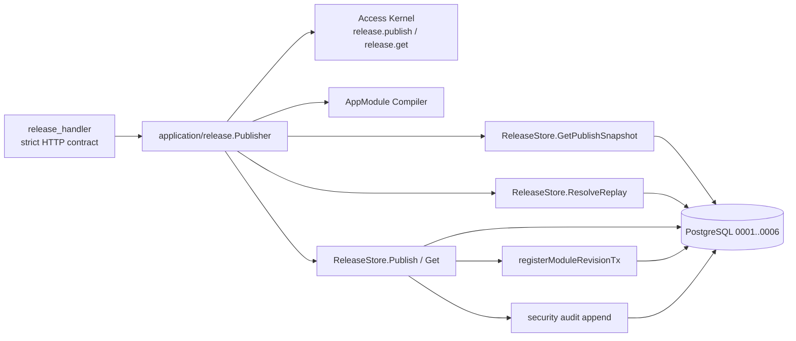
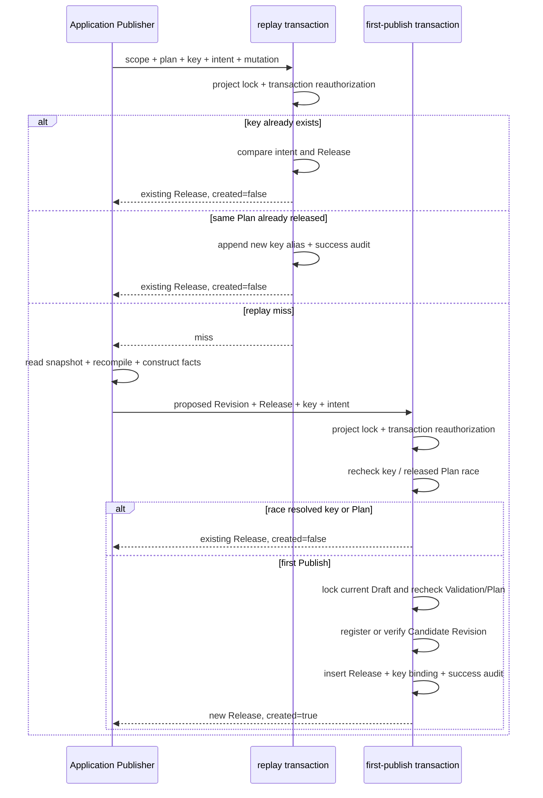

<!--
    Panvara
    docs/architecture-review-release-publish.md    2026-07-19
     ______     __  __     ______     ______     __     __
    /\  ___\   /\ \_\ \   /\  ___\   /\___  \   /\ \  _ \ \
    \ \___  \  \ \  __ \  \ \  __\   \/_/  /__  \ \ \/ ".\ \
     \/\_____\  \ \_\ \_\  \ \_____\   /\_____\  \ \__/".~\_\
      \/_____/   \/_/\/_/   \/_____/   \/_____/   \/_/   \/_/.com

    @link    : https://github.com/shezw/panvara
    @author  : shezw
    @email   : hello@shezw.com
-->

# P0-02a Module Release Publish 实现审计

本文只记录 migration `0006_module_publish_facts.sql` 与对应 Go 实现中已经存在的架构事实。未来范围仍以 [Server Core 路线图](roadmap/server-core.md) 为准。

## 审计结论

P0-02a 已形成一条窄的发布纵向切片：项目 Owner 用一个精确 `plan_id` 发起 Publish；Application 先通过 PostgreSQL 短事务二次授权并解析已发布事实，未命中时才读取并复验 Draft/Validation/Plan、重新编译 Source；PostgreSQL 再用首次发布事务二次授权、幂等登记 Candidate Revision，并追加 environment-scoped Module Release、专用幂等绑定和成功安全审计。

该切片没有活动版本。公开 OpenAPI 与 Record Runtime 继续使用启动时装配的 Revision；Release response 固定返回未激活、未迁移、Runtime 未改变且不支持激活。

## 组件与依赖

| 层 | 已实现边界 | 代码位置 |
| --- | --- | --- |
| Domain | UUIDv7 Release ID、publishable Outcome、不可变 ModuleRelease、完整 Scope 与 Credential provenance | `internal/domain/release` |
| Application | Publish/Get、精确 snapshot chain、stale/not-publishable、Source 复编译、Candidate 身份/Canonical IR 核对、专用 intent hash | `internal/application/release` |
| Access | 固定 `release.publish`、`release.get` Operation；Invocation → MutationContext | `internal/application/access` |
| Infrastructure | Snapshot Reader、重放解析事务、首次发布事务、Revision 事务内登记、Release Detail | `internal/infrastructure/postgres/release_store*.go` |
| HTTP | POST Collection、GET Detail、严格 JSON/Key/query/body/method 与错误映射 | `internal/interfaces/httpapi/release_*.go` |
| Bootstrap | ReleaseStore/Publisher 构造及 Handler 注入 | `cmd/panvara/server_runtime.go` |

Application 和 Domain 不依赖 PostgreSQL 或 HTTP。PostgreSQL adapter 实现 Application 定义的 `SnapshotReader` 与 `ReleaseStore` Port；HTTP 只消费 `ReleasePublisherService`。

## 重放解析与首次发布复验

`Publisher.Publish` 的实际顺序是：

1. 固定 `release.publish`，通过 Access Kernel 预授权，并校验 Module、SHA-256 Plan ID 和专用 Idempotency Key。
2. 构造 MutationContext 与 scoped intent hash，把 Key、Plan 与调用证据交给 `ResolveReplay`。
3. `ResolveReplay` 在 PostgreSQL 短事务中取得 Project advisory lock、二次授权；已绑定 Key/相同意图返回原 Release，已发布 Plan/新 Key 原子追加 alias 与成功审计后返回原 Release。
4. 已发布事实命中后直接返回，不读取当前 Draft；同 Key/不同意图在 Plan 查找前返回冲突。
5. 只有未命中时，才以 Project + Module + Plan ID 读取唯一 Plan、绑定的 Validation 与 Draft 当前头。
6. 核对 Project、Module、Draft ID/generation、Validation ID、Baseline、Source format/hash、Candidate 与 Plan 身份，并拒绝 stale、invalid Validation 与 `unsupported` Outcome。
7. 用保存的 Source 重新执行严格 Compiler，并核对 Module Version、Revision、Data Schema format/fingerprint 与 Canonical IR。
8. 构造 `origin=publish` 的 Revision 和携带完整 Scope/Credential/Request provenance 的 ModuleRelease，再把它们、Key 与 intent hash 交给首次发布事务。

Plan 保存 Candidate identity 与 Canonical IR，但不保存当时的 OpenAPI/Manager Schema 字节。Publish 使用当前受控 Compiler 生成这两项并写入 Revision；当前实现没有跨 Core 版本的 plan-time 生成物比较。

成功 Publish 支持 `compatible`、`review_required`、`migration_required`；Domain 不接受 `unsupported` 或 `critical` risk 的 Release 事实。

## PostgreSQL 权威事务

Migration `0006`：

- 把 Revision provenance 约束从 bootstrap-only 扩展为 `bootstrap` 或受控 `publish`。
- 为 Plan 增加 Project + Module + Plan ID 唯一身份，以及覆盖 Release 所引用字段的候选键。
- 新增 `panvara_module_release`，主键包含 Project、Environment、Module 和 Release UUIDv7；同一 Scope/Module/Plan 唯一。
- Release 外键精确引用 Environment、Draft、完整 Plan identity、Baseline/Candidate Revision、Principal 与 Credential。
- 新增 `panvara_module_release_idempotency`，以 Project、Environment、Module、Key 为主键，并外键引用 Release。
- 两张新表均以 trigger 拒绝 UPDATE、DELETE 与 TRUNCATE。

`ResolveReplay` 与 `ReleaseStore.Publish` 的实际事务顺序：

两个事务都在读取或写入幂等事实前完成事务内再授权。Project advisory lock 与唯一约束共同串行化同一 Project 的访问 mutation、重放 alias 和首次 Publish。首次发布失败发生在 commit 前时，Revision、Release、Key Binding 与成功安全审计处于同一回滚边界；alias 的 Key Binding 与成功安全审计也共享自己的回滚边界。

Revision 已由 bootstrap 登记时，`registerModuleRevisionTx` 验证父制品相同并返回首次事实；它不覆盖 `origin`、`registered_by` 或 `registered_at`。Release 仍引用相同 Candidate Revision。

## HTTP 事实

已注册路径：

- `POST /api/admin/core/v1alpha1/modules/{module}/releases`
- `GET /api/admin/core/v1alpha1/modules/{module}/releases/{release}`

POST 要求单个 `Idempotency-Key` 与只含 `plan_id` 的严格 JSON。字段按原始精确 ASCII 比较；未知字段、大小写别名、Unicode 混淆、重复字段、多个 Key、query 与错误 method 被拒绝。GET 不接受 query 或 Body。

首次创建返回 201 和 `Location`；已有同 Key/同意图或同 Plan/新 Key 返回 200；GET 返回 200。认证、授权与发布错误分别映射为 400/401/403/404/409/422/503。Release 成功和错误响应都带 `Cache-Control: private, no-store`。

## 已验证边界

- Domain/Application/HTTP 单元测试覆盖 Release 不变量、UUIDv7、精确链、stale、unsupported、Source 重编译、授权拒绝、Store 错误归一化与严格 HTTP 输入。
- PostgreSQL 集成测试覆盖 migration、发布事务、Plan stale 后的 Key/Plan 重放、冲突优先级、并发、作用域、append-only 与失败回滚。
- 真实 listener + PostgreSQL Server smoke 覆盖 Draft → Validate → Plan → Publish，Draft 改变后的原 Key重放、同 Plan 新 Key、异 Plan 冲突、GET 和重启后 POST 重放。
- Server smoke 在 Publish 前后及多次重启后比较公开 OpenAPI Revision、生成物 ETag 与 Record JSON 字节；它们保持不变。

## 当前不存在的状态

当前数据结构和 Go 类型中没有 ActiveRelease、ProjectReleaseSnapshot、ReleaseEpoch、MigrationRun、RollbackRecord、Outbox Message 或 Node Release Status。ModuleRelease 没有可变 status 字段；HTTP 也没有 Activate、Rollback、Delete 或 Release List 路径。

Release 具有 `environment_id`，但 Draft、Revision 与 Record 的既有权威表仍主要按 Project 隔离。当前 Access Kernel 只允许 active 默认 Environment；该实现不构成多 Environment 数据隔离。
