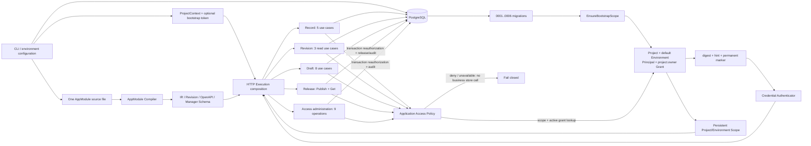
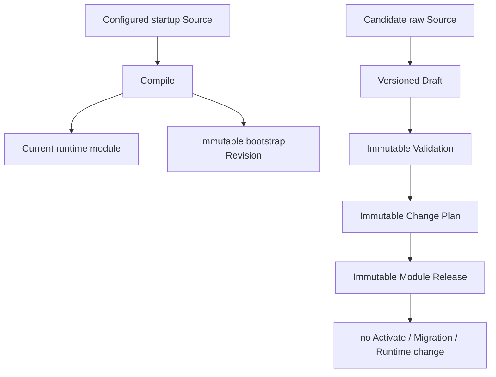

<!--
    Panvara
    docs/architecture-review-server-current.md    2026-07-18
     ______     __  __     ______     ______     __     __
    /\  ___\   /\ \_\ \   /\  ___\   /\___  \   /\ \  _ \ \
    \ \___  \  \ \  __ \  \ \  __\   \/_/  /__  \ \ \/ ".\ \
     \/\_____\  \ \_\ \_\  \ \_____\   /\_____\  \ \__/".~\_\
      \/_____/   \/_/\/_/   \/_____/   \/_____/   \/_/   \/_/.com

    @link    : https://github.com/shezw/panvara
    @author  : shezw
    @email   : hello@shezw.com
-->

# 当前 Server 架构事实审计

本文以包含 migration `0006_module_publish_facts.sql` 的当前实现为审计基线，只记录能够从代码和测试直接确认的事实，不描述未来方案。P0-02a 的专项实现审计见 [Module Release Publish 实现审计](architecture-review-release-publish.md)；未来范围与待办分别见 [Server Core 能力清单](roadmap/server-core) 和 [Manager 范围与验收](roadmap/manager)。

## 状态结论

当前存在一个可以启动的 `server` Profile。它验证的是：单个进程加载单个 Project 与单个 AppModule、连接 PostgreSQL、提供 Record/Revision/Draft/Release HTTP API，并持久化默认 Environment、project-local Principal、API Credential、精确作用域内的 `project.owner` Grant、bootstrap marker、最小安全审计与不可变 Module Release。

P0-01a/P0-01b 与 P0-02a 的可运行切片已经完成：Record 的 5 个用例、Revision 的 3 个读取用例、Draft 的 8 个用例、Release 的 2 个用例与 Access Administration 的 9 个固定 Operation 都在 Application 层使用 Credential-backed `Execution` 和同一个 Access Kernel。完整 P0-01/P0-02 尚未完成；当前没有 Account、ExternalIdentity、Session、ProjectMembership、动态 Role/Policy、RecordOwner、多 Environment 事实隔离，也没有 Activate/Rollback、Migration 与 Provider 用例授权。

仓库中没有表示“Server Core 完成”的独立成熟度模型。`internal/bootstrap/profile/profile.go` 的布尔字段只被启动入口用于判断 Profile 是否有可执行装配路径；它不检查身份、发布、迁移、事件、Provider、Worker 或分布式能力。

## 运行装配

`cmd/panvara/server_runtime.go:buildServerApplication` 是当前 Server 的组合根，按以下顺序装配：

1. 从一个文件读取最多 1 MiB 的 YAML 或 JSON Source。
2. 使用 AppModule Compiler 生成 Canonical IR、Revision、OpenAPI 与 Manager UI Schema。
3. 从启动配置构造一个 `ProjectContext` 与匿名 Public Actor。
4. 连接一个 PostgreSQL 数据库并执行包含 `0006` 的 migration。
5. `ProjectAccessStore.EnsureBootstrapScope` 在某个 Project ID 首次启动时原子创建 Project、默认 Environment、Principal 与 Owner Grant；同一 Project ID 的后续启动只核对持久化身份和设置并返回同一 Scope。新的 Project ID 与唯一 Key 会形成另一套 Scope。
6. 用首启 Token 创建 digest-only Credential 与永久 marker，或在 marker 已存在时完成省略/相同/冲突核对。
7. 装配 Credential Authenticator、Access Administration、最小安全审计与 Application Access Policy。
8. 登记 bootstrap Module Revision，装配 Draft Workflow、Release Publisher、Record Service、Access Handler 与 HTTP Router。
9. 使用数据库 Ping 作为 readiness 来源。

## 已存在的代码边界

| 层 | 当前组件 | 直接代码依据 |
| --- | --- | --- |
| Spec | 严格 AppModule v1alpha1 YAML/JSON DTO、Schema 与解码 | `internal/spec/appmodule/v1alpha1` |
| Domain | AppModule Descriptor/Revision/Draft；ModuleRelease；Project/Environment/Scope；Principal/Credential/OwnerGrant；Actor/Money | `internal/domain/appmodule`、`internal/domain/release`、`internal/domain/project`、`internal/domain/access`、`internal/domain/actor`、`internal/domain/value` |
| Application | Access Kernel、Credential authentication/bootstrap/administration、Compiler、Registry、Draft、Release Publish/Get、Record | `internal/application/access`、`internal/application/appmodule`、`internal/application/release`、`internal/application/record` |
| Interfaces | 运维端点、模块制品、Record、Revision、Draft、Release 与 Access Administration HTTP | `internal/interfaces/httpserver`、`internal/interfaces/httpapi` |
| Infrastructure | PostgreSQL Project/Access Admin/Auth/Audit、Record、Revision、Draft/Release Store 与 migration | `internal/infrastructure/postgres`、`db/migrations` |
| Bootstrap | Lite/Server Profile 选择与 Server 组合根 | `internal/bootstrap/profile`、`cmd/panvara` |

## 持久化执行作用域

Migration `0004_project_environment_access.sql` 新增四组事实：

| 事实 | 当前约束与行为 |
| --- | --- |
| `panvara_project` | UUIDv7 `project_id`、唯一 `project_key`、默认 Locale/Time Zone/Currency 与 `active`/`disabled` 状态；启动配置与已有设置冲突时拒绝启动 |
| `panvara_environment` | Project 内 UUIDv7 身份与 Key；部分唯一索引保证每个 Project 至多一个 `is_default=true`；bootstrap 创建一个默认 Environment |
| `panvara_principal` | Project 内 bootstrap/Service Principal、display name 与 `active`/terminal `disabled` 状态；Service Principal 由管理 API 创建 |
| `panvara_access_grant` | 精确绑定 Project、Environment、Principal 与固定 `project.owner`；撤销后可由另一 Owner 显式重新授予，启动不自动补回 |

首次初始化按 Project 获取事务级 advisory lock，在一个事务内插入四组事实。相同设置的重启复用持久化 Environment ID；Project 已存在后，启动只核对 Project 设置、默认 Environment Key 与 Principal，不会补回缺失或已撤销的 Grant。

`ProjectAccessStore.ScopeActive` 只把 active Project 下 active 且标记为默认的精确 Environment 视为可执行。`0001`–`0003` 的 Record、Revision 与 Draft 表仍只有 `project_id`，没有 `environment_id`；因此当前是“执行契约携带 Environment，但只允许默认 Environment”，不是多 Environment 数据隔离。

Migration `0005` 为 Principal 增加 kind/display/disabled facts，为 Grant 增加 actor 与 lifecycle facts，并新增 API Credential、permanent bootstrap marker 与 security audit event。原始 bootstrap Token 不入库；Application 计算 SHA-256，PostgreSQL 保存 digest、`sha256:<12 hex>` hint 与 Credential metadata。marker 存在后启动可省略 Token，相同 digest 可核对，不同 digest 冲突；marker 关联 Credential 即使 revoked 也不被重启恢复。

`CredentialAdminAuth` 通过 `CredentialAuthenticator` 按精确 Scope 查找数据库 Credential、比较 digest、检查 Credential/Principal active，再把 Credential-backed Principal 放入请求上下文。`AuthenticatedPrincipal` 私有封装 Credential 证明的 Project + Environment Scope、Actor 与 Credential ID；`NewAdminExecution` 要求其 Scope 与执行 Scope 完全相同。所有 Admin 用例随后仍读取 Owner Grant；认证失败映射 401，Grant/Scope 拒绝映射 403，权威状态读取失败映射 503。

## Application Access Kernel

`internal/application/access` 定义 `Execution = Project/Environment Scope + Actor + Credential evidence + Surface`、现有业务与访问管理固定 Operation、`Authorizer` 与 authority reader。Actor 所属 Project 必须与 Scope Project 一致，Admin Execution 必须携带有效 Credential ID。Policy 不读取 Actor 自报 Role：它依次查询精确 Scope、Credential 与 `project.owner` Grant；未知操作或权威状态读取失败都 fail closed。

| Application 边界 | 已授权用例 | Operation 数量 |
| --- | --- | --- |
| Record Service | List、Get、Create、Update/Patch、Delete | 5 |
| Revision Registry | List、Get、GetSource | 3 |
| Draft Workflow | Create、Get、GetSource、Replace、Validate、Plan、GetValidation、GetPlan | 8 |
| Release Publisher | Publish、Get | 2 |
| Access Administration | Principal List/Create/Disable；Credential List/Issue/Revoke；Owner List/Grant/Revoke | 9 |

Public Surface 只能通过 Access Kernel 进入 Record Operation，之后 Record Service 仍执行 AppModule 的资源/Surface/Operation Policy。Admin Surface 要求 Credential-backed Actor 和精确作用域内 active、未撤销的 `project.owner` Grant。HTTP Adapter 负责验证 Credential 与构造 `Execution`，但最终允许/拒绝发生在 Application 用例内。

Access Administration mutation 与 Release Publish 都在 PostgreSQL Project advisory transaction lock 下重新验证调用 Credential 与 Owner Grant，再写 mutation 与成功审计。Release Publish 先用短事务解析已绑定 Key/已发布 Plan；未命中时，首次发布事务再次授权、重查并发 race，再锁定 Draft 当前头、复验 Validation/Plan、登记 Candidate Revision、Module Release 与专用幂等绑定。Disable Principal、Revoke Credential、Revoke Owner Grant 检查至少剩余一个 active Principal + active Credential + active Owner Grant 路径。Principal disable 与 Credential revoke 是终态；Owner Grant 可由仍授权调用者显式 PUT 重新授予，启动流程不自动补回。

`RevisionRegistry.RegisterBootstrap` 是当前唯一不接收 `Execution` 的登记路径；它只由 Server 组合根在 migration 和 Scope 初始化后调用，没有 HTTP 路由。

## AppModule 当前表达力

`internal/spec/appmodule/v1alpha1/document.go` 与 `internal/domain/appmodule/descriptor.go` 当前包含：

- Module name、SemVer、labels、module requirements、capabilities 与 conflicts。
- Resource 与 Field。
- `string`、`text`、`int`、`bool`、`decimal`、`enum`、`date`、`datetime`、`email`、`money`、`reference` 共 11 种 Field Kind。
- Required、Unique、Reference、Enum、Max Length、Precision 与 Scale。
- Public/Admin operation、writable、filterable 与 sortable 声明；当前非空 sortable 会被拒绝。
- Manager list columns、filters 与 form fields 的展示顺序。

Compiler 位于 `internal/application/appmodule/compiler.go`。它输出 Canonical IR、完整 Revision Hash、Data Schema format 1 fingerprint、OpenAPI 3.1 与 `manager.panvara.dev/v1alpha1` UI Schema。

## Record 当前链路

`internal/application/record/service.go` 暴露 Create、Get、List、Update 与 Delete。PostgreSQL 实现位于 `internal/infrastructure/postgres/store.go`。

当前 Record Scope 由 Project、Module、Resource 与完整 Module Revision 组成。数据库保存：

- flex JSONB Record 与乐观版本。
- 唯一值索引。
- Reference 索引。
- 创建、更新时间与软删除时间。

HTTP 表面提供 Public Create 与模型允许的 Admin CRUD。Patch 和 Delete 使用强 ETag/`If-Match`；List 使用 limit、cursor 与等值 `filter[field]`。每个 Record Application 方法同时接收访问 `Execution` 与 Record Scope，先校验二者 Project 一致，再经过 Access Kernel 和 AppModule Operation Policy，最后才调用 Record Store。

## 模型变化准备链路

当前启动 Source 与候选 Source 是两条分离链路：

`internal/application/appmodule/revision_registry.go` 登记/读取不可变 Revision；Server 启动与 P0-02a Publish 是当前两个受控登记入口。`internal/application/appmodule/draft_workflow.go` 支持 Draft Create/Get/Replace、Validation 与 Plan；`internal/application/release` 复验精确链并创建 Module Release。它们都没有 active pointer，也不会把 Candidate 切换到 Runtime。

## 当前数据库事实

| Migration | 当前权威事实 |
| --- | --- |
| `0001_flex_record.sql` | Record、唯一值与 Reference |
| `0002_module_revision_registry.sql` | Module Revision 与 Data Schema Identity |
| `0003_module_draft_workflow.sql` | Draft、Validation 与 Change Plan |
| `0004_project_environment_access.sql` | Project、Environment、Principal 与 `project.owner` Grant |
| `0005_project_access_administration.sql` | Principal/Credential/Grant lifecycle、bootstrap marker 与最小 security audit |
| `0006_module_publish_facts.sql` | environment-scoped Module Release、发布专用幂等绑定与 publish Revision provenance |

`0005` 扩展 `0004` Principal/Grant 并新增 API Credential 与最小 access security audit。`0006` 新增 append-only Release 与专用 idempotency，并通过复合外键绑定 Environment、Draft、完整 Plan identity、Candidate Revision、Principal 与 Credential。仓库当前 migration 中仍没有 Account、ExternalIdentity、Session、ProjectMembership、动态 Role/Policy、RecordOwner、Activation、Migration Run、通用 Audit/Idempotency/Outbox、Event、Job、Provider、Asset、Node 或 Partition 表。

## 当前运行与运维接口

- `GET /healthz`：进程存活。
- `GET /readyz`：Lite 固定就绪；Server 使用 PostgreSQL Ping。
- `GET /version`：构建版本信息。
- Server 启动缺少数据库、Module Source 或 Project ID 时 fail fast；marker 不存在且缺 bootstrap Token 时 fail fast，marker 已存在后可省略 Token。
- 当前只有一个 HTTP Listener，没有 gRPC、Worker 进程或消息消费者入口。

## 当前不存在的实现

在本次审计的 Go package、migration 与前端文件中，未发现以下实现：

- 可视化 Manager 应用；现有 Manager UI Schema 是 JSON 制品。
- Account、ExternalIdentity、Session、Team、ProjectMembership、动态 Role/Permission/Policy、RecordOwner 与人类登录；当前只有 project-local Service Principal/API Credential/固定 Owner Grant。
- Record Owner、字段/动作级授权，以及既有事实的 `environment_id`、回填、复合约束、游标和幂等隔离；非默认 Environment 当前会被拒绝。
- Activate、Rollback、活动 Revision、Release Snapshot、epoch 或数据迁移执行器；P0-02a 只有不可变 Publish/Get。
- Activate/Rollback、Migration、Provider、Job/Event 用例及其 Access Kernel Operation；Release Publish/Get 已存在。
- 通用 Audit、Idempotency、Transactional Outbox、Inbox、Event Bus、Job、Schedule、Retry 或 Dead Letter；当前只有最小 append-only security audit 与 Release 专用 idempotency。
- Provider Descriptor、Provider Instance、Credential Reference、Capability Resolution 或第三方 Adapter Runtime。
- Asset/Object Storage、Search、Site、Commerce 或 Payment Runtime。
- 多 Project 请求路由、多节点发布收敛、Partition 路由、分布式锁、缓存或服务发现。

这些条目只表示当前仓库中没有相应实现，不表示未来范围或优先级。
