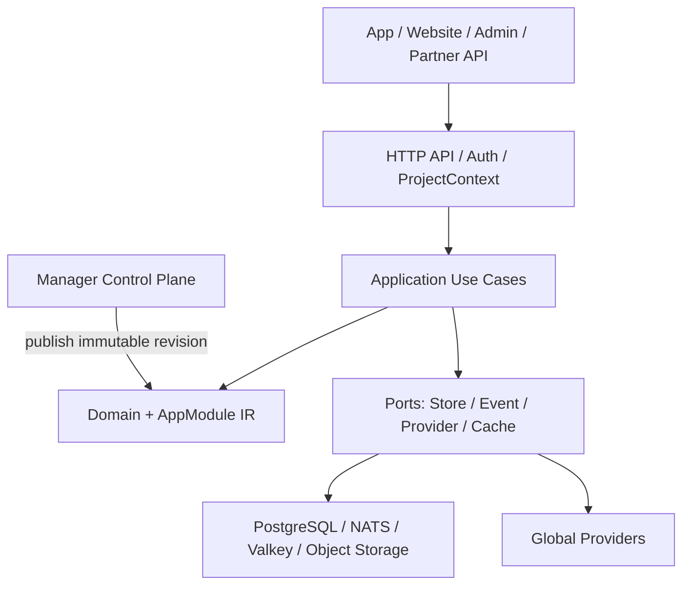
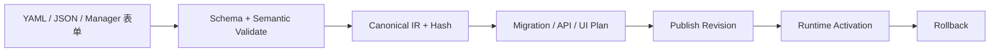

<!--
    Panvara
    docs/arch.md    2026-07-14
     ______     __  __     ______     ______     __     __
    /\  ___\   /\ \_\ \   /\  ___\   /\___  \   /\ \  _ \ \
    \ \___  \  \ \  __ \  \ \  __\   \/_/  /__  \ \ \/ ".\ \
     \/\_____\  \ \_\ \_\  \ \_____\   /\_____\  \ \__/".~\_\
      \/_____/   \/_/\/_/   \/_____/   \/_____/   \/_/   \/_/.com

    @link    : https://github.com/shezw/panvara
    @author  : shezw
    @email   : hello@shezw.com
-->

# Panvara 总体架构

## 1. 定位与约束

Panvara 是一套数据模型驱动、可组合、面向全球第三方生态的 Go 全栈框架。目标用户是个人与中小开发团队；它可以从精简 Server 起步，按项目需要增加 Manager、Website、Assets、Commerce 与独立 Worker。

这里的“全球化”首先是产品能力和 Provider 覆盖，不是首版建设跨洲强一致基础设施。首阶段的明确边界是：

- 单区域内从单机扩展到数百台内网服务器。
- 从数千并发逐步扩展到十万、百万并发；容量必须由基准和压测证明，架构不预先承诺固定数字。
- 远距离区域作为独立 Partition，暂不提供跨区强一致写入。
- 默认单项目部署；多项目托管是后续能力，不让首版背负完整 SaaS 多租户复杂度。

## 2. 架构判断

Panvara 采用“模块化单体优先、按运行角色拆分”的方式，而不是把每张表和每个领域对象形式化地拆成微服务。

代码依赖只能指向内层：

    interfaces -> application -> domain <- infrastructure

- Domain 是纯 Go 规则，不依赖数据库、HTTP、消息中间件和 Provider SDK。
- Application 编排用例和事务，通过 Port 接口请求外部能力。
- Interfaces 负责 HTTP、CLI、未来的 gRPC 和 Manager 接口。
- Infrastructure 实现 PostgreSQL、消息、缓存、对象存储与第三方适配。
- Bootstrap 根据 Profile 显式装配实现；禁止隐藏式全局依赖和 Service Locator。

## 3. 可组合运行 Profile

| Preset | 适用场景 | 运行角色 / 业务能力 | 外部依赖 |
| --- | --- | --- | --- |
| Lite | 小工具、原型、嵌入式服务 | all-in-one / AppModule | 无 |
| Server | 通用 App 后端 | server / AppModule | PostgreSQL |
| Manager | 需要管理后台 | server + manager / AppModule | PostgreSQL |
| Site | 内容站与网站 | server / AppModule + Site + Assets | PostgreSQL；对象存储可选 |
| Commerce | 商城或付费产品 | server / AppModule + Commerce + Payments | PostgreSQL；缓存可选 |
| Distributed | 分离 API 和 Worker | server + worker / 可配置业务能力 | PostgreSQL；NATS 可选 |

Preset 是常用组合，不是继承树：Site 不强制 Manager，Commerce 不强制 Site，Headless 场景是一等公民。实现上把运行角色与业务 Feature 分开配置；只有当负载、隔离、安全或发布节奏确有差异时才拆进程。alpha.1 仅实现 Lite，其余 Preset 被识别为 planned 并拒绝伪启动。

## 4. 数据模型驱动模块

动态模块不以“上传任意代码”为目标，而以受控声明生成能力：

AppModule v1alpha1 首批表达：

- Resource、Field、Relation、索引与基础约束。
- 基础 CRUD、校验、角色/所有者权限、标签和审计元数据。
- 受控 Action 和 Event；副作用只能调用注册过且具备权限的 Capability。
- Manager 表单和列表的 UI Schema。
- 模块依赖、能力声明、冲突和版本约束。

模块依赖与 Capability 依赖是两种不同关系：前者形成确定的模块拓扑，后者由 Bootstrap 从本地模块或 Provider Adapter 中解析。字段/Resource、模块名和 Capability 分别使用独立命名规则，避免把 JSON Path、SQL 映射和协议命名混为一谈。

alpha.2 开始把作者输入和 Canonical Domain 分离：

    spec/appmodule/v1alpha1 DTO + decoder
                    -> application compiler
                    -> domain/appmodule canonical model
                    -> immutable Module IR

旧 Spec 通过 Converter 进入当前 Canonical Model；Domain 不携带 YAML 兼容分支。

明确禁止：

- 任意 Go、JavaScript、Shell 或 SQL。
- 模型直接持有 Provider 密钥。
- 绕过事务、权限、审计和资源限额的表达式。
- 未经 Plan/Publish 就修改活动数据库结构。

模型发布采用 Draft → Validate → Plan → Publish → Activate；每个 Revision 使用内容哈希标识，可审计、可回滚。自然语言模型只负责生成候选声明，Core 的确定性校验器与发布器才拥有最终决定权。

## 5. 全球 Provider 体系

Core 面向 Capability 编程，第三方厂商只是 Adapter。Provider 协议独立版本化，并要求超时、幂等、重试分类、凭据引用、审计和健康检查。

| Capability | 标准优先 | 可选 Adapter 示例 |
| --- | --- | --- |
| Identity | OIDC / OAuth 2.x / WebAuthn | Google、Apple、Microsoft、Facebook、GitHub、微信 |
| Payment | PaymentIntent、Webhook、Refund 抽象 | Stripe、Adyen、PayPal、支付宝、微信支付；Apple Pay/Google Pay 作为钱包能力 |
| Email | 模板化发送与投递事件 | SMTP、Amazon SES、Postmark、SendGrid |
| SMS | 发送、状态回执、区域路由 | Twilio、区域供应商 |
| Push | 设备令牌和主题消息 | APNs、FCM |
| Object | S3 风格对象接口 | S3-compatible、Google Cloud Storage、Azure Blob |
| Media/CDN | 变换任务与公开资产 URL | 可插拔媒体与 CDN 服务 |

第三方列表是生态覆盖方向，不表示全部进入 Core。Core 只保留稳定 Capability；厂商 SDK 和变化快的字段留在 Adapter。

全球 Provider 还必须遵守：

- 每次新操作按 Project、国家/地区、币种、方法和 Capability 显式路由。
- 长期外部对象保存 Provider Instance、配置 Revision、Credential Version 与 External Reference。
- 支付处理中不得透明切换 Provider。
- 外部身份以 Issuer/Provider Instance + Subject 唯一定位，禁止按 Email 自动合并。

## 6. 分布式管理

标准分布式形态分成数据面和控制面：

- 数据面：无状态 API 节点和可水平扩展 Worker；请求显式携带 ProjectContext。
- 控制面：Manager 管理模型、配置、Provider 引用和发布；产出不可变 Revision。
- PostgreSQL：业务事实、发布记录、审计和 Outbox 的权威存储。
- PostgreSQL Outbox + SKIP LOCKED：首个 Server/Worker 拆分方案，避免过早增加中间件。
- NATS JetStream：需要多消费者、回放或经压测证明 PostgreSQL 队列不足时加入；消息只是事实副本，不替代数据库事务。
- Valkey：可丢失缓存、限流和短期协调；不是业务事实来源。
- 对象存储：资产和大对象；数据库只保存元数据与引用。

发布流程由数据库事务写入 Revision 与 Outbox，Worker 分发激活提示，节点按哈希加载并上报状态。PostgreSQL Registry 始终是权威，消息丢失时节点轮询收敛。

每次发布生成不可变 ProjectReleaseSnapshot、单调 epoch 和 Module Hash Map。节点先下载、校验并 ACK prepared，控制面再原子提升 active epoch；请求、Job 和 Event 开始时固定 epoch，处理中不得切换。未追平目标 Project 的节点不得承接该 Project 流量；失败发布保持 last-known-good，不改变 active epoch。

单区容量扩大时优先做无状态扩容、读写路径分析、缓存和队列削峰，再考虑领域拆库。

## 7. 微服务拆分准则

只有满足下列一个或多个条件才拆独立服务：

- 负载模型明显不同，例如 HTTP 短请求与媒体转码长任务。
- 安全边界不同，例如支付 Webhook 与普通内容服务。
- 故障隔离或资源隔离有明确收益。
- 团队所有权和发布节奏已经独立。
- 数据所有权可以清晰定义，不靠跨服务同步事务维持。

建议的演进顺序：

1. 单进程 Lite。
2. Server + PostgreSQL。
3. Server + Manager；静态资源走对象存储/CDN。
4. API 与 Worker 分离，通过 Outbox 和消息交接。
5. Commerce、Media 等高差异领域独立部署。
6. 数百节点时加入集中配置发布、分区路由、容量治理和故障演练。

不建议首期引入服务网格、跨区共识、每模块独立数据库或 Kubernetes Operator。这些能力可以保留接口位置，但必须由真实规模触发。

## 8. 数据与全球化原语

- ID：ProjectID 使用 UUIDv7，ProjectKey/Slug 单独建模；业务记录使用 UUIDv7 或等价的全局有序标识，不对外暴露数据库自增主键。
- 时间：持久化 UTC 时间点，展示与日历计算使用 IANA Time Zone；拒绝随宿主机变化的 Local。
- Locale：使用 BCP 47 标签；文案、格式和业务数据翻译分开建模。
- Currency：ISO 4217 风格代码；金额使用 int64 最小货币单位，不使用浮点。
- Country/Region：使用稳定代码和可更新目录，不把政治或税务规则硬编码进 Core。
- 删除与审计：业务删除、保留策略和不可变审计事件分开表达。

alpha.1 对 Locale 和 Currency 只做结构校验。v0.1 前要接入标准 BCP 47 Parser、可版本化 ISO 4217 Catalog 与 minor-unit exponent，并在发行物中固定 IANA 时区数据来源。

## 9. 当前落地与后续

v0.1.0-alpha.1 已落地版本信息、Profile 描述、ProjectContext、Money、AppModule 描述校验与依赖注册、Kernel 生命周期、健康接口和自动化门禁。

尚未落地 PostgreSQL Adapter、模型持久化、发布状态机、Manager、Provider Runtime 和分布式进程。这些按 [Core v0 计划](core-v0.md) 逐步进入，而不是提前创建空实现。

开发和质量基线分别见 [开发环境](development.md) 与 [验证测试框架](testing.md)。
