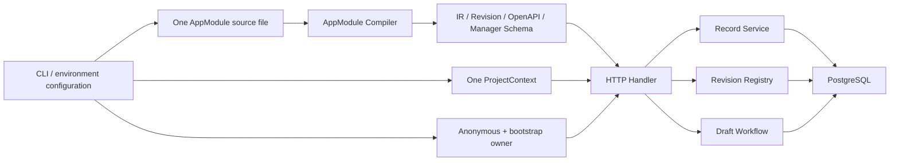
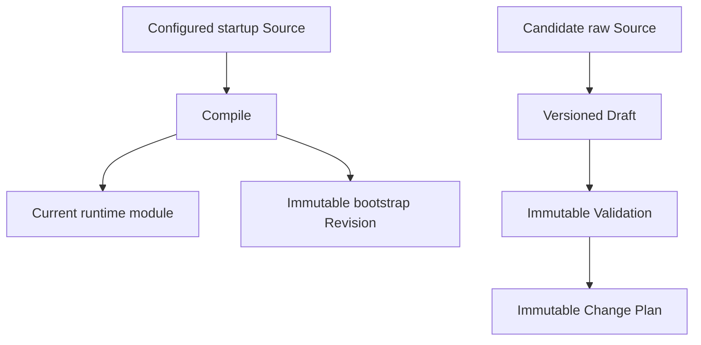

<!--
    Panvara
    docs/architecture-review-server-current.md    2026-07-18
     ______     __  __     ______     ______     __     __
    /\  ___\   /\ \_\ \   /\  ___\   /\___  \   /\ \  _ \ \
    \ \___  \  \ \  __ \  \ \  __\   \/_/  /__  \ \ \/ ".\ \
     \/\_____\  \ \_\ \_\  \ \_____\   /\_____\  \ \__/".~\_\
      \/_____/   \/_/\/_/   \/_____/   \/_____/   \/_/   \/_/.com

    @link    : https://github.com/shezw/panvara
    @author  : shezw
    @email   : hello@shezw.com
-->

# 当前 Server 架构事实审计

本文以提交 `22183ab` 为实现审计基线，只记录能够从代码和测试直接确认的事实，不描述未来方案。未来范围与待办分别见 [Server Core 能力清单](roadmap/server-core) 和 [Manager 范围与验收](roadmap/manager)。

## 状态结论

当前存在一个可以启动的 `server` Profile。它验证的是：单个进程加载单个 Project 与单个 AppModule、连接 PostgreSQL、提供基础 Record API，并保存 Revision Registry 与 Draft/Validation/Plan 事实。

仓库中没有表示“Server Core 完成”的独立成熟度模型。`internal/bootstrap/profile/profile.go` 的布尔字段只被启动入口用于判断 Profile 是否有可执行装配路径；它不检查身份、发布、迁移、事件、Provider、Worker 或分布式能力。

## 运行装配

`cmd/panvara/server_runtime.go:buildServerApplication` 是当前 Server 的组合根，按以下顺序装配：

1. 从一个文件读取最多 1 MiB 的 YAML 或 JSON Source。
2. 使用 AppModule Compiler 生成 Canonical IR、Revision、OpenAPI 与 Manager UI Schema。
3. 构造一个 `ProjectContext`、一个匿名 Actor 与一个 `bootstrap-admin` Owner Actor。
4. 连接一个 PostgreSQL 数据库并执行 migration。
5. 登记 bootstrap Module Revision。
6. 装配 Draft Workflow、Record Service 与 HTTP Handler。
7. 使用数据库 Ping 作为 readiness 来源。

## 已存在的代码边界

| 层 | 当前组件 | 直接代码依据 |
| --- | --- | --- |
| Spec | 严格 AppModule v1alpha1 YAML/JSON DTO、Schema 与解码 | `internal/spec/appmodule/v1alpha1` |
| Domain | AppModule Descriptor、Revision、Draft；Project、Actor、Money 值类型 | `internal/domain/appmodule`、`internal/domain/project`、`internal/domain/actor`、`internal/domain/value` |
| Application | Compiler、Catalog、Revision Registry、Draft Workflow、Record CRUD | `internal/application/appmodule`、`internal/application/record` |
| Interfaces | 健康/就绪/版本端点、模块制品、Admin/Public Record、Revision 与 Draft HTTP | `internal/interfaces/httpserver`、`internal/interfaces/httpapi` |
| Infrastructure | PostgreSQL Record、Revision、Draft Store 与 migration | `internal/infrastructure/postgres`、`db/migrations` |
| Bootstrap | Lite/Server Profile 选择与 Server 组合根 | `internal/bootstrap/profile`、`cmd/panvara` |

## AppModule 当前表达力

`internal/spec/appmodule/v1alpha1/document.go` 与 `internal/domain/appmodule/descriptor.go` 当前包含：

- Module name、SemVer、labels、module requirements、capabilities 与 conflicts。
- Resource 与 Field。
- `string`、`text`、`int`、`bool`、`decimal`、`enum`、`date`、`datetime`、`email`、`money`、`reference` 共 11 种 Field Kind。
- Required、Unique、Reference、Enum、Max Length、Precision 与 Scale。
- Public/Admin operation、writable、filterable 与 sortable 声明；当前非空 sortable 会被拒绝。
- Manager list columns、filters 与 form fields 的展示顺序。

Compiler 位于 `internal/application/appmodule/compiler.go`。它输出 Canonical IR、完整 Revision Hash、Data Schema format 1 fingerprint、OpenAPI 3.1 与 `manager.panvara.dev/v1alpha1` UI Schema。

## Record 当前链路

`internal/application/record/service.go` 暴露 Create、Get、List、Update 与 Delete。PostgreSQL 实现位于 `internal/infrastructure/postgres/store.go`。

当前 Record Scope 由 Project、Module、Resource 与完整 Module Revision 组成。数据库保存：

- flex JSONB Record 与乐观版本。
- 唯一值索引。
- Reference 索引。
- 创建、更新时间与软删除时间。

HTTP 表面提供 Public Create 与模型允许的 Admin CRUD。Patch 和 Delete 使用强 ETag/`If-Match`；List 使用 limit、cursor 与等值 `filter[field]`。当前 Record Application 方法接收 Scope 与 Surface，但不接收 Actor；HTTP Handler 仍承担部分 operation 授权。

## 模型变化准备链路

当前启动 Source 与候选 Source 是两条分离链路：

`internal/application/appmodule/revision_registry.go` 只登记和读取不可变 bootstrap Revision。`internal/application/appmodule/draft_workflow.go` 支持 Draft Create/Get/Replace、Validation 与 Plan。二者都没有 active pointer，也不会把 Candidate 切换到 Runtime。

## 当前数据库事实

| Migration | 当前权威事实 |
| --- | --- |
| `0001_flex_record.sql` | Record、唯一值与 Reference |
| `0002_module_revision_registry.sql` | Module Revision 与 Data Schema Identity |
| `0003_module_draft_workflow.sql` | Draft、Validation 与 Change Plan |

仓库当前 migration 中没有 Account、Identity、Session、Role、Policy、Release、Activation、Migration Run、Audit、Outbox、Event、Job、Provider、Credential、Asset、Node 或 Partition 表。

## 当前运行与运维接口

- `GET /healthz`：进程存活。
- `GET /readyz`：Lite 固定就绪；Server 使用 PostgreSQL Ping。
- `GET /version`：构建版本信息。
- Server 启动缺少数据库、Module Source、Project ID 或 bootstrap admin Token 时 fail fast。
- 当前只有一个 HTTP Listener，没有 gRPC、Worker 进程或消息消费者入口。

## 当前不存在的实现

在本次审计的 Go package、migration 与前端文件中，未发现以下实现：

- 可视化 Manager 应用；现有 Manager UI Schema 是 JSON 制品。
- Account、外部 Identity、Session、Team、Membership、Role/Permission/Policy、API Key 或 Service Account。
- Publish、Activate、Rollback、活动 Revision、Release Snapshot、epoch 或数据迁移执行器。
- Audit Event、Transactional Outbox、Inbox、Event Bus、Job、Schedule、Retry 或 Dead Letter。
- Provider Descriptor、Provider Instance、Credential Reference、Capability Resolution 或第三方 Adapter Runtime。
- Asset/Object Storage、Search、Site、Commerce 或 Payment Runtime。
- 多 Project 请求路由、多节点发布收敛、Partition 路由、分布式锁、缓存或服务发现。

这些条目只表示当前仓库中没有相应实现，不表示未来范围或优先级。
