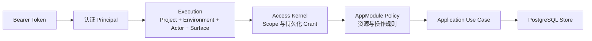

<!--
    Panvara
    docs/modules/project-access.md    2026-07-18
     ______     __  __     ______     ______     __     __
    /\  ___\   /\ \_\ \   /\  ___\   /\___  \   /\ \  _ \ \
    \ \___  \  \ \  __ \  \ \  __\   \/_/  /__  \ \ \/ ".\ \
     \/\_____\  \ \_\ \_\  \ \_____\   /\_____\  \ \__/".~\_\
      \/_____/   \/_/\/_/   \/_____/   \/_____/   \/_/   \/_/.com

    @link    : https://github.com/shezw/panvara
    @author  : shezw
    @email   : hello@shezw.com
-->

# 执行作用域与访问内核使用指南

## 用途

执行作用域与访问内核负责回答两个 Server 核心问题：一次业务操作精确属于哪个 Project/Environment，以及当前 Principal 是否真的拥有执行该操作的权限。

P0-01a 把 Project、默认 Environment、bootstrap Principal 和 `project.owner` Grant 持久化到 PostgreSQL；P0-01b 再把 Credential 认证、Service Principal 与 Grant 管理接到同一边界。HTTP Bearer 只用于确认“调用者是谁”；真正的 Admin 权限由 Application 层读取 active Principal/Credential 与持久化 Grant 决定，不再信任请求或 Provider 自报的 Role/Email。



## 当前状态

这是 **P0-01a + P0-01b 可运行切片**，不是完整 P0-01，也不是完整 IAM。

当前已实现：

- 某个 `PANVARA_PROJECT_ID` 首次启动时，在一个事务中创建 Project、一个默认 Environment、`bootstrap-admin` Principal 和精确作用域内的 `project.owner` Grant。
- 默认 Environment 使用生成的 UUIDv7；相同配置重启时复用同一持久化身份。
- 并发首次启动通过 Project 级事务锁收敛到同一组事实。
- Record 的 5 个用例、Revision 的 3 个读取用例和 Draft 的 8 个用例在 Application 层固定操作名称并先授权，拒绝时不会访问业务 Store。
- Public Surface 只可进入 Record 用例，并继续接受 AppModule 的逐资源、逐操作策略检查；Admin Surface 必须有未撤销的持久化 Owner Grant。
- Project、默认 Environment、Principal 或 Grant 状态变化会立即影响后续请求；撤销 Grant 后重启不会偷偷恢复权限。
- 未识别操作、非默认 Environment、跨 Project Actor、数据库授权状态读取失败均 fail closed。
- 首次启动为 bootstrap Token 写入 digest、hint 与永久 marker；后续可省略、相同可用、改变拒绝，Credential revoked 后不会被重启复活。
- Owner 可通过 [访问管理 API](access-administration.md)管理 Service Principal、Credential 与固定 `project.owner` Grant；Principal disable 与 Credential revoke 是终态，Grant 只允许显式重新授予。
- 所有新增管理写操作在 PostgreSQL 事务内二次授权并写入最小安全审计；最后一个可用 Owner path 不能被移除。

## 前置条件

- 使用 `server` Profile。
- PostgreSQL 18.4 已启动。
- 已准备合法 Project Context、AppModule 和 32–1024 字节、仅含 Bearer 安全 ASCII、非 `pvk1.` 前缀的 bootstrap Token。
- 当前 Shell 已加载 `.env` 与 `.env.local`。

第一次运行建议使用仓库提供的初始化命令：

```bash
make local-init
set -a; . ./.env; . ./.env.local; set +a
make infra-up
```

如果 `.env` 是此前版本创建的，可以手工加入 `PANVARA_ENVIRONMENT_KEY=default`；未设置时内置默认值也是 `default`。

## 最小示例

启动 Server：

```bash
make run-server
```

在另一个已加载相同环境变量的终端中查看持久化作用域：

```bash
docker compose -f deploy/compose/compose.yaml exec -T postgres \
  psql -U panvara -d panvara -c \
  "SELECT p.project_key, e.environment_key, e.environment_id, e.is_default, p.status AS project_status, e.status AS environment_status FROM panvara_project p JOIN panvara_environment e USING (project_id);"
```

查看 Principal 与 Grant：

```bash
docker compose -f deploy/compose/compose.yaml exec -T postgres \
  psql -U panvara -d panvara -c \
  "SELECT principal_id, role, revoked_at FROM panvara_access_grant;"
```

应看到一个默认 Environment，以及 `bootstrap-admin` 的未撤销 `project.owner` Grant。数据库不会保存原始 Admin Token，但会保存 SHA-256 digest、非敏感 hint、Credential 元数据与永久 bootstrap marker。不要查询或输出 digest；验收 Credential 生命周期应使用[Project-local 访问管理指南](access-administration.md)。

## 配置

| 配置 | 示例或默认 | 首次启动作用 | 后续重启行为 |
| --- | --- | --- | --- |
| `PANVARA_PROJECT_ID` | UUIDv7 | 查找或创建精确 Project 身份 | 相同 ID 复用；新 ID 表示另一 Project，不迁移旧数据 |
| `PANVARA_PROJECT_KEY` | `default` | 创建全局唯一的可读 Project Key | 同一 Project ID 内漂移时拒绝启动 |
| `PANVARA_PROJECT_LOCALE` | `en-US` | 创建默认 Locale | 同一 Project ID 内漂移时拒绝启动 |
| `PANVARA_PROJECT_TIME_ZONE` | `UTC` | 创建默认 IANA Time Zone | 同一 Project ID 内漂移时拒绝启动 |
| `PANVARA_PROJECT_CURRENCY` | `USD` | 创建默认 Currency | 同一 Project ID 内漂移时拒绝启动 |
| `PANVARA_ENVIRONMENT_KEY` | `default` | 创建该 Project 唯一的默认 Environment Key | 同一 Project ID 内漂移时拒绝启动 |
| `PANVARA_ADMIN_TOKEN` | 无 | marker 不存在时创建 digest-only bootstrap Credential；32–1024 字节、仅 Bearer 安全 ASCII、非 `pvk1.` 前缀 | marker 存在后可省略，相同可核对，不同值拒绝；不会恢复 revoked Credential |

启动配置只在某个 Project ID 首次初始化时提供定义。之后数据库事实是该 Project 权限与身份的权威来源，Server 不会用配置静默覆盖已存在的设置，也不会在发现 Grant 缺失或已撤销时自动补回。Grant 只能由仍有权限的 Owner 显式 PUT 重新授予。使用新的 Project ID 和新的唯一 Project Key 会显式创建另一套 Project 事实，而不是修改或迁移原 Project。

## 验收

先完成 [CRM Leads 完整验收](../getting-started/crm-leads-acceptance.md) 中的 Admin 读取，确认返回 200。然后按 [Project-local 访问管理验收](access-administration.md#验收)创建第二个 Owner path，以管理 API 撤销其中一个 Grant，并验证：

- 被撤权 Credential 的认证仍可成功，但 Admin 用例返回 403。
- Server 重启不会自动补回 revoked/missing Grant。
- 另一个仍有效 Owner 可通过显式 PUT 重新授予，恢复后无需重启即返回 200。
- 尝试停用、撤销或撤权最后一个可用 Owner path 返回 409 `last_owner_path`，事务不留下半状态。

不要直接 UPDATE 授权表来模拟正常管理流程；它会绕过 Application 授权、last-owner 防护与安全审计。

开发者可运行完整自动验收：

```bash
make test-integration
make test-server-smoke
```

测试覆盖首次初始化、digest/marker 幂等重启与冲突、配置漂移、状态停用、非默认 Environment 拒绝、Credential/Grant 管理、显式重新授予、last-owner 防护，以及重启不恢复 revoked/missing 权限。

## 常见问题

### 为什么 Token 正确仍返回 403？

Bearer 只证明请求对应一个 project-local Principal。Project、默认 Environment、Principal 与 Credential 必须都是 active，且精确 `(project_id, environment_id, principal_id, project.owner)` Grant 未撤销。Credential 问题返回 401；Grant 问题返回 403；权威存储不可用返回 503。

### 可以在请求里声明自己是 Owner 吗？

不可以。Actor 中为了兼容保留的 Role 信息不参与 Access Kernel 决策。Admin 权限只读取 PostgreSQL 中的 Grant。

### 修改 `.env` 能更新 Project 设置吗？

不能。对相同 Project ID 修改 Project Key、Locale、Time Zone、Currency 或 Environment Key 会导致启动失败，避免配置漂移静默改写持久化身份。正式修改流程将在 Project 管理能力中提供。

### 更换 Project ID 会修改或迁移原项目吗？

不会。新的 Project ID 配合新的全局唯一 Project Key 会创建另一套 Project、默认 Environment、Principal 与 Grant，旧 Project 和业务数据保持不变。当前一个 Server 进程仍只装配一个 Project；多个固定单 Project 进程可以共享数据库，但没有按域名或请求动态路由 Project 的能力。不要把更换 ID 当作配置修改或数据迁移手段。

### 为什么 Public Create 不要求 Owner Grant？

Public 是业务表面，不是管理表面。Access Kernel 只允许它进入 Record 用例，随后 AppModule 仍会检查该 Resource 是否显式开放对应操作。Revision 与 Draft 永远不能从 Public Surface 访问。

### Environment 已持久化，为什么还不能用多个环境？

现有 Record、Revision、Draft 等事实表还没有 `environment_id`。因此 P0-01a 只允许一个 active 默认 Environment，其他 Environment 会被 Access Kernel 拒绝，避免制造虚假的隔离承诺。

## 当前限制

- 只有一个由启动配置创建的默认 Environment，没有 Environment CRUD 或切换 API。
- 已有业务事实仍按 Project 隔离，尚未按 Environment 隔离。
- 只有 bootstrap/Service Principal、API Credential 和固定 `project.owner` Role，没有 Account、ExternalIdentity、Session、ProjectMembership、动态 Role/Policy 或 RecordOwner。
- Credential 支持一次性签发、显式轮换与 revoke，但没有到期、MFA、密码或 Google/Apple/Facebook/微信登录。
- Release、Migration 和 Provider 用例尚未实现，因此也未接入 Access Kernel。
- 每次授权读取 PostgreSQL；缓存、失效协议和高并发压测将在真实瓶颈出现后设计。
- Grant 管理只支持固定 `project.owner`，没有动态角色、列表分页或生产级恢复工作流。

## 兼容与升级

Migration `0004_project_environment_access.sql` 新增持久化作用域；`0005_project_access_administration.sql` 扩展 Principal/Grant 并新增 API Credential、永久 marker 和最小 append-only security audit。升级后，当前 Project 首次完成 `0005` 初始化仍需原 bootstrap Token；marker 成功创建后可在后续启动省略。相同 Token 可核对，不同 Token 拒绝，revoked Credential 不会复活。

现有 Record、Revision 与 Draft 数据被解释为属于该 Project 的默认 Environment，但表中尚无可验证的 Environment 身份。未来支持真正多 Environment 时，必须先设计 `environment_id` 回填、复合键/唯一约束、分页游标、幂等键和升级回滚测试，不能仅增加路由参数。

Access Kernel 位于 Application 层，未来无论保持模块化单体，还是把 Manager、Worker 或 Provider 拆成独立服务，都应传递同一份精确 Execution，并让服务端重新验证权威 Grant，不能把 HTTP 中间件或调用方声明当成最终授权。
