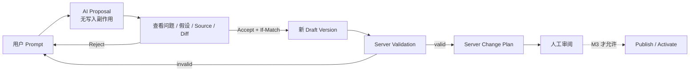

<!--
    Panvara
    docs/roadmap/manager.md    2026-07-18
     ______     __  __     ______     ______     __     __
    /\  ___\   /\ \_\ \   /\  ___\   /\___  \   /\ \  _ \ \
    \ \___  \  \ \  __ \  \ \  __\   \/_/  /__  \ \ \/ ".\ \
     \/\_____\  \ \_\ \_\  \ \_____\   /\_____\  \ \__/".~\_\
      \/_____/   \/_/\/_/   \/_____/   \/_____/   \/_/   \/_/.com

    @link    : https://github.com/shezw/panvara
    @author  : shezw
    @email   : hello@shezw.com
-->

# Manager 产品与工程验收路线图

::: warning 当前状态
Panvara 当前没有可运行的 Manager Web 应用，`manager` Profile 仍是 planned。已经生成的 `manager.panvara.dev/v1alpha1` UI Schema 只是前端展示契约；Revision、Draft、Validation 和 Change Plan 是 Server 控制面用例，也不能计为 Manager UI 已完成。
:::

## 1. 产品定义

### 1.1 一句话定位

Manager 是通过与 Panvara Server 同源 URL 提供给浏览器的薄 Web 控制台；前端制品可以独立构建或托管，但生产入口应由 Server 或反向代理统一同源暴露。它由两类能力组成：

- **模型驱动的数据管理界面**：根据 AppModule、Manager UI Schema 和 OpenAPI 渲染受控的 Resource 列表、详情与表单。
- **模块生命周期控制界面**：帮助项目所有者准备、验证、审阅、发布、激活和回滚模型变化。

Manager 不拥有领域规则，也不成为第二个 Server。所有数据校验、授权、并发控制、模型编译、变化分类、迁移、发布和运行状态都以 Server Application 用例为权威。

### 1.2 责任边界

| 能力 | Manager 负责 | Server 负责 |
| --- | --- | --- |
| 展示 | 导航、表格、表单、Diff、状态和错误反馈 | 返回稳定、版本化的机器契约 |
| 数据操作 | 收集输入、按契约组装请求、处理分页和冲突 | 权限、校验、事务、唯一值、引用和持久化 |
| 模型编辑 | Source 编辑器、自然语言辅助、人工确认 | 编译、Validation、Change Plan 和不可变身份 |
| 发布 | 展示风险、要求确认、查询进度 | Publish、迁移、Activate、Rollback 和 last-known-good |
| AI | 收集 Prompt、展示/拒绝/接受不可信 Proposal、展示假设和 Diff | 以派生 ActorContext 调用受控模型 Provider、持久化 Proposal、上下文隔离和确定性验证边界 |
| 安全 | 不泄露凭据、正确处理会话和前端攻击面 | 认证、授权、Credential Reference、审计和资源限额 |

Manager 必须遵守以下原则：

1. UI Schema 只表达展示提示，OpenAPI 表达传输契约，Server 表达业务事实。
2. 界面隐藏按钮不能代替服务端授权。
3. 未知协议、状态不一致或缺失 capability 时 fail closed。
4. Manager 不从列表顺序、时间戳或客户端缓存推导 active Revision。
5. AI 输出、用户 Source 和标签都属于不可信输入。

### 1.3 产品目标与成功信号

- 项目所有者打开 Manager 后 5 分钟内可完成第一条受支持 Record 的浏览或维护，无需 `curl`。
- 所有 AppModule 已声明的 Admin CRUD 都能通过生成式界面完成，不要求手写 HTTP 请求。
- 从自然语言或文本到 Draft、Validation 和 Plan 不需要本地文件、Git 或 CI/CD。
- 完成 M3 后，从 Draft 到 Activate 也不依赖代码仓库，但每一步仍产生可导出、可复验的 Source、Revision 和审计事实。
- 所有并发写入都使用 Server 的 ETag/CAS 或幂等契约，绝不静默覆盖。
- Manager 不能把“已登记”“Validation 通过”“Plan compatible”误显示为“已发布”或“已激活”。

## 2. 目标用户与核心任务

| 角色 | 核心任务 | 首次进入阶段 |
| --- | --- | --- |
| 项目所有者 / 小团队开发者 | 检查 Server；管理数据；创建 Draft；审阅变化；发布、激活和回滚；配置 Provider | M0–M3 |
| 业务数据维护者 | 不接触 YAML、API 或数据库，维护被授权的 Resource | M1；多人使用需 M4 身份与 RBAC |
| 审阅者 / 支持人员 | 只读查看模型变化、发布结果、审计和失败请求 ID | M3–M4 |
| 部署运维者 | 查看 Server/Worker 节点、epoch、发布收敛、积压和 Partition，不直接改数据库事实 | M4–M5 |

当前 bootstrap Token 只代表单一 `project.owner`，不能安全地让多人共享。M0–M3 可以作为 Owner Preview；面向团队成员的生产使用必须等待 M4 的账号、会话和细粒度授权。

## 3. 信息架构

```text
项目
├── 概览
│   ├── Server 与数据库状态
│   ├── Distribution / 协议版本
│   └── 当前运行 Revision
├── 数据
│   └── Resource
│       ├── 列表与过滤
│       ├── 记录详情
│       └── 新建 / 编辑 / 删除
├── 模型
│   ├── 当前模型
│   ├── Drafts
│   │   ├── Source 编辑
│   │   └── AI Assistant / Proposal
│   ├── Validations / Change Plans
│   ├── Revisions
│   └── Releases / Rollback
├── 连接
│   └── Provider / Credential Reference
├── 活动
│   ├── Audit
│   └── 发布、迁移与 Worker 任务
├── Runtime（启用 Distributed 后）
│   ├── Server / Worker 节点
│   ├── Release epoch 与 rollout
│   └── Partition / 容量状态
└── 设置
    ├── Project Context
    └── 成员与权限
```

v0.1 默认单项目、单 Environment、单模块，界面不提前加入复杂的组织、租户和模块切换器。Manager 实例只连接当前 Server 所属 Environment，必须清楚显示环境身份，但不在 Core 内膨胀成跨环境发布总控台。导航项只在 Server capability manifest 明确支持时出现，不能靠发请求等待 404 来猜测功能。

## 4. 当前基础与缺口

| 能力 | 当前基础 | Manager 缺口 |
| --- | --- | --- |
| Profile | `manager` 名称与角色组合已定义 | `Runnable=false`，没有启动和验收链路 |
| 展示契约 | Manager UI Schema 含 Resource、字段、widget、列表和表单顺序 | 没有前端、capability 握手、Reference 显示身份和完整可用性契约 |
| Record | Admin CRUD、过滤、cursor、ETag 和错误信封已实现 | 没有表格、表单、冲突恢复和浏览器验收 |
| Revision | List、Detail、Source 只读 API 已实现 | 没有当前运行对照和 Revision 浏览界面 |
| Draft | Create、Get、Replace、Validate、Plan 已实现 | 没有 Draft List、工作区、Source Diff 和 AI Proposal |
| 生命周期 | 只有准备变化事实 | 没有 Publish、Activate、Rollback、迁移、active pointer 和审计 |
| 身份 | bootstrap owner Token | 没有账号、会话、团队角色和字段权限管理 |
| Provider | Capability 只进入声明 | 没有 Provider Runtime、Credential Reference 或连接管理 |

## 5. 分阶段路线图

### M0：Manager Contract 与安全外壳

#### 目标

项目所有者能安全打开 Manager，确认连接的是哪个 Project、Server 和运行模型；协议不兼容时界面不会执行写操作。

#### 范围

- 实现 `manager` Profile，提供同源 Manager SPA 和 Server API。
- Manager Shell、路由、深链、错误边界和按 capability 生成的导航。
- Preview Token 解锁、退出和 401/403 状态处理。
- 概览页：health、readiness、buildinfo、Project/Environment Context、模块和当前运行 Revision。
- 加载并交叉检查 OpenAPI 与 Manager UI Schema。
- 建立前端契约测试、浏览器 E2E、可访问性和安全基线。

#### Server 前置

- Manager 静态资源的同源服务方式。
- Bootstrap/capability manifest：Project、Environment、Actor、Roles、Module、协议版本和已启用功能。
- Project/Environment Context 与模块目录读取契约。
- 当前运行 Revision 的权威读取；当前阶段仍从 OpenAPI `x-panvara-revision` 获取。

#### Acceptance

- [ ] `--profile=manager` 在依赖完整时启动成功，缺少 PostgreSQL、Project 或 Token 时 fail fast。
- [ ] `/manager/` 和任意前端深链刷新后都能恢复，不返回 API 404 页面。
- [ ] Server 不可达、未就绪或协议不支持时显示明确原因和恢复建议。
- [ ] 页头和所有发布、Provider、删除等危险确认均明确显示当前 Project 与 Environment，用户不能在不知环境的情况下执行操作。
- [ ] Manager UI Schema 的 `revision` 与 OpenAPI `x-panvara-revision` 不一致时，界面进入只读状态。
- [ ] 未知 Core API、Module Spec 或 Manager Schema 版本 fail closed，不尝试猜测渲染。
- [ ] 当前 Revision 只按 OpenAPI 精确值标记，Registry 第一项永远不会被推断为 active。
- [ ] Token 不写入 URL、Local Storage、Session Storage、IndexedDB、普通日志或错误报告。
- [ ] Logout 后内存中的 Token 清除；401 重新锁定；403 显示权限不足而不是登录过期。
- [ ] UI 中没有 capability 时，对应路由和操作入口均不存在。
- [ ] 前端自动化测试覆盖启动、深链、协议不兼容、401、403、503 和 Schema 不一致。

### M1：生成式 Resource Console

#### 目标

非专业技术用户能通过模型生成的列表和表单完成 Server 已开放的 Admin CRUD，无需理解 API、UUID 版本或 JSON 格式。

#### 范围

- 按 Module / Resource 组织的数据导航。
- List、精确等值过滤、cursor 分页、空态和错误态。
- Get、Create、Patch、Delete。
- string、text、int、bool、decimal、enum、date、datetime、email、money、reference 共 11 种字段控件。
- system field 只读、模型字段校验提示和 Server violation 映射。
- Record ETag 冲突恢复、删除确认、引用和唯一值冲突反馈。
- Locale、Time Zone 和 Currency 感知的显示。

#### Server 前置

- 当前 Admin CRUD/OpenAPI/Manager UI Schema 契约保持一致。
- Manager 使用的 reference 目标必须提供可读显示身份和有界选择查询；不能只给目标 Resource 名称。
- Server 继续作为 writable、filterable 和 operation allowlist 的最终权威。

#### Acceptance

- [ ] CRM Leads 的 Organization 和 Lead 均可完成 List/Get/Create/Patch/Delete 允许的完整旅程。
- [ ] 表格列和过滤器顺序与 Manager UI Schema 一致；未开放字段和操作不出现。
- [ ] List 默认请求 20 条、最多 100 条；`next_cursor` 能继续翻页，过滤变化后游标清零。
- [ ] 不显示动态排序、模糊搜索、批量操作等 Server 未实现能力。
- [ ] 11 种字段都有成功、必填错误、格式错误和边界值浏览器测试。
- [ ] Create 只发送 Admin writable 字段；Patch 只发送用户实际修改的字段。
- [ ] `id`、`version`、`created_at`、`updated_at` 等 system field 不可编辑。
- [ ] decimal 和 money 不经过 JavaScript 浮点换算；提交值保持协议要求的精确形态。
- [ ] reference 控件显示可识别标签，同时保留并提交 UUIDv7；目标不可读时 fail closed。
- [ ] 422 `details.path` 映射到字段，页面同时提供可复制的 `request_id`。
- [ ] Patch/Delete 始终携带最新 ETag；412 时不覆盖，展示服务端最新值和用户未提交修改。
- [ ] `unique_conflict`、`record_referenced`、401、403、404 和 500 都有不同、可行动的提示。
- [ ] 当前 Server 不支持 `null`/unset 时，表单不提供虚假的“清空字段”操作。
- [ ] 所有成功操作在刷新页面后仍由 Server 数据恢复，浏览器不充当事实存储。

### M2：模型工作区与 Prompt-to-Draft

#### 目标

开发者可以在 Manager 中用文本或自然语言准备模型变化，得到确定性 Validation 和 Change Plan；整个阶段不修改 Runtime、不迁移 Record，也不需要本地文件、Git 或 CI/CD。

#### 范围

- 当前模型、Revision List/Detail/Source 和原始 Source 下载。
- Draft List、创建、读取、Source 编辑、Diff、保存和恢复。
- 明确选择当前 Revision、指定 Revision 或 `none` 作为 Baseline。
- Validation violations、warnings、Candidate 和 stale 状态。
- Change Plan classification、risk、changes、blockers、effects 和 stale 状态。
- AI Assistant：Prompt-to-Draft、基于当前 Draft 修订、澄清问题、Proposal、人工 Accept。
- Source 与 Proposal 的敏感信息、保留和 Provider 使用提示。

#### Server 前置

- Draft List，且能在刷新后重新发现 Draft。
- 已有 Draft Source CAS、Validation 和 Plan 契约继续保持不可变与可重放。
- Assistant Proposal 用例及可替换的模型 Provider Port。
- AI 凭据只能由 Server Credential Reference 解析，浏览器不持有 Provider Key。

#### Acceptance

- [ ] 用户可从当前运行 Revision、指定 Revision 或 `none` 建立 Draft，Baseline 创建后不可变。
- [ ] Draft 列表刷新后仍可找回工作区，不依靠浏览器保存 Draft ID。
- [ ] Source 编辑器支持 YAML/JSON、未保存提醒、原始下载和 Baseline Diff。
- [ ] Create 使用持久化 Idempotency Key；相同意图重放不创建第二个 Draft。
- [ ] Replace、Validate 和 Plan 都使用最新 Draft Version ETag；412 进入人工冲突处理。
- [ ] `valid=false` 被显示为成功产生的校验事实，不误报为 Server 故障。
- [ ] violation 的 code、stage、path、message 和 severity 完整可见；无法定位到行时仍能定位 Source/模型路径。
- [ ] Plan 明确显示 `migration_execution_supported`、`record_namespace_changed` 和全部 effects。
- [ ] stale Validation/Plan 仍可查看，但不能作为当前 Draft 的后续输入。
- [ ] Plan 后 OpenAPI Revision、Registry Candidate 数量和 Record 快照均不改变。
- [ ] Prompt 可以创建新模块 Draft，也可以基于已有 Draft 提议修改。
- [ ] AI Provider 超时、失败、取消或输出越界时，Draft Version、Runtime 和 Record 均不改变。
- [ ] Proposal 显示完整 Source/Diff、summary、assumptions 和 questions，Accept 前没有写入副作用。
- [ ] Accept 使用 Proposal 所绑定 Draft 的 If-Match；旧 Proposal 遇到新 Draft Version 时返回 412，不能覆盖。
- [ ] Accept 恰好形成一个 Draft Version；随后必须调用 Server Validation，AI 自称“有效”没有产品语义。
- [ ] 用户可明确要求 AI 根据 violations 产生另一个 Proposal，但修复不能自动写入或循环上线。
- [ ] Publish/Activate 尚未实现时，界面没有可操作的发布或激活按钮。

### M3：发布、迁移、激活与回滚

#### 目标

项目所有者能把当前有效 Draft 经人工审阅后安全变成活动 Revision；失败保持 last-known-good，整个用户旅程不依赖代码仓库或 CI/CD。

#### 范围

- Publish：精确引用当前 Validation 与 Change Plan，生成不可变 Revision。
- 迁移前置条件、备份要求、blocker 和风险确认。
- 异步迁移 operation/job 状态、失败原因和可恢复动作。
- Activate：原子切换活动 Revision 或完整失败。
- Rollback/Recovery：展示 Server 判定的 pointer-only 资格、兼容窗口、数据恢复策略与禁止原因，不删除任何新事实。
- Release history、desired active 状态和 observed runtime 状态。
- 模型生命周期审计。

#### Server 前置

- Publish/Activate/Rollback 状态机、Rollback Eligibility、数据恢复策略与幂等契约。
- active pointer；分布式阶段使用 ProjectReleaseSnapshot、单调 epoch 和 Module Hash Map。
- 显式、幂等的数据迁移执行，保留 Record ID 并重建 unique/reference 约束。
- operation/job 查询、last-known-good 和失败恢复。
- 不可变审计与 Outbox。

#### Acceptance

- [ ] Publish 只接受当前 Draft Version 的有效 Validation 和对应 Plan；stale 输入被 Server 拒绝。
- [ ] Publish 产生不可变 Revision，不覆盖 Draft、Registry 或历史 Source。
- [ ] destructive/review 变化必须展示 Server blocker、迁移与备份要求，并进行额外人工确认。
- [ ] 客户端确认不能绕过 Server 的拒绝条件。
- [ ] 长迁移返回 operation/job ID；关闭或刷新浏览器后可以继续查询，不依赖长连接请求存活。
- [ ] Activate 成功后，控制面 active Revision 与运行时 OpenAPI Revision 可分别核对。
- [ ] Activate 事务失败、迁移失败或节点未准备好时，旧活动 Revision 继续服务。
- [ ] 界面分别显示控制面 Revision 回切与数据恢复策略；只有 Server 返回 `pointer-only eligible` 时才允许直接重新激活旧 Revision。
- [ ] 已有新版本写入或破坏性迁移时，Manager 必须展示写入 fence、向前修复、反向迁移或带 RPO 的备份恢复计划，不能用一个“回滚”按钮掩盖数据语义。
- [ ] Rollback 保留新 Revision、迁移和失败事实；被 Server 判定为不安全时只能阻断并解释原因。
- [ ] 重复 Publish/Activate/Rollback 请求按幂等契约返回原结果，不产生重复副作用。
- [ ] 每一步记录 actor、时间、request ID、输入身份、结果和审计事件。
- [ ] 多节点界面分别显示 desired active epoch 与各节点 observed runtime epoch，不能合并成一个含糊的“已发布”。
- [ ] 从 Prompt 或 Source 编辑到 Activate 的 E2E 不需要本地文件、Git 或 CI/CD，但 Source、Plan、Revision 和审计均可导出复验。

### M4：团队、Provider 与生产运维

#### 目标

Manager 从单一 owner Preview 演进为可供小团队日常使用的生产预览控制台，同时保持范围小于通用 SaaS 管理平台。

#### 范围

- Account、Session、成员和角色；bootstrap Token 仅用于首次初始化或紧急恢复。
- Resource/operation/field 权限结果展示与受控配置。
- Project Context 读取与版本化修改。
- Provider Descriptor、Instance、Config Revision、Credential Reference、测试和健康状态。
- 首个参考能力为 Console Email 与 SMTP/Mailpit。
- Audit、迁移、Outbox 和 Worker 活动页；只提供受控、可授权的重试。
- Server 支持后增加多模块导航；不扩展为多租户 SaaS 控制台。

#### Server 前置

- 完整身份、会话撤销和 Application 层授权。
- Provider Runtime、Capability Resolution、Credential Reference 和健康检查。
- Audit、Outbox、Worker 查询与安全重试契约。
- Project Context 的读取和版本化修改契约。

#### Acceptance

- [ ] 数据维护者不能读取 Source、发布模型、查看 Provider 凭据或修改权限。
- [ ] 审阅者不能执行任何 mutation；Owner 权限由 Server Application 层验证。
- [ ] 会话可撤销，权限变更立即按明确一致性契约生效并写审计。
- [ ] 团队成员不共享 bootstrap Token，Token 不作为常规登录方式。
- [ ] Project Locale、Time Zone、Currency 修改由 Server 校验并形成可追踪配置 Revision。
- [ ] Provider Secret 只在受控输入时发送一次；Server 永不回传明文，刷新后只显示引用和脱敏状态。
- [ ] Test Connection 与 Activate Config 是两个不同动作，测试成功不会自动切换活动配置。
- [ ] Provider 配置修改形成 Revision，外部操作可追踪 Provider Instance、Config Revision 和 Credential Version。
- [ ] Audit 事件不能从 Manager 修改或删除，可按时间、actor、类别和结果查询。
- [ ] Worker/Outbox 只有 Server 明确标记为可重试且 Actor 有权限时才显示重试操作。
- [ ] M4 E2E 覆盖 Owner、数据维护者、审阅者三个角色的允许与拒绝矩阵。

### M5：分布式运行管理与扩展面板（条件阶段）

#### 目标

只有项目启用 Distributed Profile 时，运维者才能观察并安全处理 Panvara 自身的多节点发布、Worker 与 Partition 状态。单机或模块化单体部署不需要实现或显示本阶段，也不能因此被判定为 Manager Core 未完成。

#### 范围

- Server/Worker 节点、角色、版本、心跳、readiness、当前 Snapshot/Epoch 与容量摘要。
- Release rollout：desired、prepared、ACK、active、stale、failed 和 last-known-good。
- Worker 积压、Lease、Retry/DLQ 摘要与受权限保护的 drain/retry 操作。
- Partition Assignment、路由版本和落后节点；不提供跨区强一致的虚假开关。
- 版本化 Extension Panel Manifest，让 Site/Commerce 等可选模块贡献隔离路由和页面，不把领域规则编入 Manager Shell。

#### Server 前置

- Node Registration、Node Release Status、Release ACK、Deployment/Rollout 与单调 epoch 契约。
- Worker Heartbeat/Lease、Queue/DLQ 和安全 drain/retry 契约。
- Partition Assignment、路由版本、容量/限流指标和完整 Application 授权。
- Extension Manifest 的协议版本、权限、资源预算与故障隔离契约。

#### Acceptance

- [ ] 3 个以上 Server 节点与独立 Worker 的 E2E 能分别显示 desired 和 observed epoch；部分 ACK 不能显示为全部上线。
- [ ] 节点断连、版本落后或无法加载 active Snapshot 时标记 stale/failed，并由 Server 摘流；Manager 不能在浏览器中自行判定收敛。
- [ ] 网络分区、重复通知、乱序状态和页面刷新后，界面最终恢复 Server 权威状态，不把客户端缓存当作节点事实。
- [ ] Rollout 失败时明确显示 last-known-good、受影响节点和允许的恢复动作；无安全资格时不显示强制激活。
- [ ] Worker drain 不领取新任务，已领取任务按 Lease/优雅停止契约完成或恢复；Retry/DLQ 操作具备权限、幂等和审计。
- [ ] Partition 页面只展示 Server 返回的 Assignment/Route Version；不能拖拽节点后直接伪造路由状态。
- [ ] Extension Panel 未安装、版本不兼容、加载失败或抛错时，Manager Shell、Core 路由和其他面板仍可使用。
- [ ] 未启用 Distributed Capability 时，Runtime 导航完全不出现，M0–M4 的单机旅程不依赖 Node/Partition API。
- [ ] M5 不提供 Kubernetes、云主机或数据库运维控制台；它只管理 Panvara 的逻辑运行事实。

## 6. Prompt-to-Draft 设计约束

### 6.1 放置位置

AI Assistant 只存在于“模型 → Draft”工作区，是 Source 的作者辅助方式。它不进入概览、数据表格或全局浮动聊天，也不获得独立于当前 Project、Module 和 Draft 的操作上下文。

用户可以选择：

- **自然语言创建**：以显式 `baseline=none` 创建新模块 Draft；
- **基于当前模型修改**：下载指定 Baseline Source，建立 Draft 后提出修改；
- **修复 Validation**：由用户明确选择 violations 作为下一次 Proposal 的上下文。

### 6.2 标准流程



Proposal 不是 Draft Version、Validation、Plan、Revision 或 Release。只有人工 Accept 才能使用现有 Replace Source CAS 形成新 Draft Version。

### 6.3 最小 Proposal 契约

Proposal 请求至少绑定：

- Project、Module、Draft ID；
- 精确 Draft Version 与 Source Hash；
- 用户 Prompt 和 Locale；
- 允许发送给 Provider 的上下文范围；
- 派生后的 Actor ID、`If-Match` 和持久化 Idempotency Key。

`Authorization`/Cookie 只是 Interface 层认证材料，Server 必须先把它们转换成 ActorContext；原始凭据绝不能进入 Proposal、Prompt、Intent Hash、Idempotency Identity、Provider 请求正文、日志或持久化记录。

响应至少包含：

- `proposal_id`；
- `status: proposal | needs_clarification`；
- `based_on` Draft Version、Source Hash 和 Baseline；
- Source Format 与 proposed Source；
- summary、assumptions、questions；
- Provider/模型标识和生成时间；
- `draft_changed=false`、`published=false`、`activated=false`、`runtime_changed=false`。

同一 Idempotency Key 的重试必须返回第一次的精确 Proposal，避免重复费用和非确定结果。Proposal 至少可按 ID 重读，以支持刷新、审阅和 Accept；Prompt/输出的持久化范围与保留期必须有明确项目策略，不能顺手写入普通应用日志。

### 6.4 Accept 与验证

Accept 不是 AI API 的副作用。Manager 读取 Proposal 的 proposed Source，并使用其 `based_on.draft_version` 作为 `If-Match` 调用现有 Replace Source：

1. Draft 未变化：形成一个新 Draft Version。
2. Draft 已变化：Server 返回 412，用户重新读取、比较并决定是否再次生成 Proposal。
3. Replace 成功：用户显式执行 Server Validation。
4. Validation 通过：用户显式生成 Change Plan。
5. M3 前：流程到 Plan 截止，Runtime 必须保持不变。

### 6.5 AI 安全边界

- AI 不得直接 Publish、Activate、Rollback、迁移或写业务 Record。
- AI 不得把自己的解释当作 Validation 或 Plan 结论。
- 默认上下文仅包含用户 Prompt、AppModule Source、选择的 Validation/Plan；不发送业务 Record。
- Admin Token、数据库 URL、Provider Secret、Credential 内容和环境变量不得进入 Prompt 上下文。
- Source、labels 和 violations 中的 prompt injection 只是文本，不能调用工具或扩大权限。
- 不允许生成或执行任意 Go、JavaScript、Shell、SQL 和外部网络工具。
- 不允许自动循环“修复 → 验证 → 发布”，每次 Accept 和发布决策都需要明确的人类动作。
- 未经明确告知与授权，Prompt、Source 和 Proposal 不得用于训练或超出项目策略的长期保留。

## 7. Server API 前置契约总表

| 阶段 | 必需契约 | 当前判断 |
| --- | --- | --- |
| M0 | same-origin assets、capability manifest、Project/Environment/Actor/Role、Module Catalog、Context、版本握手 | 缺失 |
| M1 | Admin CRUD、OpenAPI、UI Schema、ETag、错误信封、reference display/options | 前五项已有；Reference 可用性不足 |
| M2 | Revision API、Draft List/Get/Source/Replace、Validation、Plan、Assistant Proposal | Revision 与大部分 Draft API 已有；List/Proposal 缺失 |
| M3 | Publish、migration operation、Activate、Rollback、active state、last-known-good、Audit/Outbox | 缺失 |
| M4 | Account/Session/RBAC、Project Config Revision、Provider/Credential、Worker/Outbox 管理 | 缺失 |
| M5 | Node/Release ACK/Rollout、Worker/Lease、Partition/Route、Extension Manifest | 条件阶段；Server Distributed 能力缺失 |

所有契约共同遵守：

1. Project、Actor、Surface 和 Operation 在 Application 用例中显式校验。
2. Mutation 使用 ETag/CAS 或 Idempotency Key；客户端不能无条件覆盖。
3. 长操作返回可恢复查询的 operation/job ID，不依赖一次 30 秒 HTTP 请求完成。
4. Error Envelope 保持稳定 code、message、request ID 和结构化 details。
5. Feature availability 由版本化 manifest 明示，不从 404、按钮配置或时间顺序推断。
6. UI Schema Revision 必须和所消费 OpenAPI Revision 一致。
7. 不可变 Revision、Validation、Plan、Release 和 Audit 事实不能被更新或删除。

## 8. 横向质量标准

### 8.1 安全与隐私

- Manager 默认与 Server 同源，Admin API 不依赖宽泛 CORS。
- 生产部署必须使用 TLS、严格 CSP、`frame-ancestors`、`nosniff` 和合适的 Referrer Policy。
- 不使用 `innerHTML` 渲染 labels、Source、error message、AI 输出或 Provider 文本。
- Markdown 或富文本预览若进入后续范围，必须使用严格 allowlist sanitizer，默认禁用原始 HTML。
- Source Editor 不执行 Source，不加载 Source 中的 URL，也不把内容传给未授权第三方。
- bootstrap Token 仅在内存中存在；正式多人场景使用 HttpOnly、Secure、SameSite 会话。
- 错误遥测、analytics 和 request log 必须清除 Authorization、Cookie、Source、Prompt 和 Secret。
- 任何 UI 权限判断都必须有对应 Server 拒绝测试。
- Module Artifact 当前无认证的可见性必须在生产化前形成明确安全决策，不能默认模型结构一定公开。

### 8.2 ETag、幂等与恢复

- Record Patch/Delete 使用 Record ETag。
- Draft Replace/Validate/Plan 和 Proposal Accept 使用 Draft Version ETag。
- Draft Create、Proposal Create、Publish、Activate 和 Rollback 使用作用域明确的 Idempotency Key。
- 412 永远进入读取最新状态和人工决策，不自动重试覆盖。
- 网络超时后先按幂等键查询原结果，不盲目重复副作用。
- 浏览器刷新、关闭和重新登录后，所有已接受事实都能从 Server 恢复。

### 8.3 国际化

- Label 选择顺序为 Project Locale 精确匹配、语言匹配、`en-US`，最后回退稳定 schema name。
- 回退只影响展示，不改变 Resource、Field、enum 或 API 的稳定标识。
- 时间点以 Server UTC 为事实，按 Project IANA Time Zone 展示。
- Money 使用 Project Locale 格式化，但提交仍是精确 `minor + currency`。
- 界面至少以 `zh-CN` 和 `en-US` Fixture 验证；缺少翻译时不能出现空标题或阻塞操作。
- AI Prompt Locale 与界面 Locale 可不同，Proposal Source 的稳定标识不能被自动翻译。

### 8.4 可访问性

- 以 WCAG 2.2 AA 为目标，自动检查之外必须完成键盘和读屏人工旅程。
- 所有表单控件有可读 label、描述、错误关联和必填状态。
- 焦点顺序稳定；Dialog 打开后管理焦点，关闭后返回触发点。
- 加载、保存、Validation 和 operation 进度通过可感知的 live region 通知。
- 风险、成功和错误不能只使用颜色表达。
- Data Table 提供可理解表头和移动焦点；无障碍名称不能只依赖 icon。
- Source Editor 提供可键盘操作的纯文本替代模式，不能强迫读屏用户使用复杂代码编辑器。

### 8.5 性能预算

- M0 开工前必须提交 `npm run manager:budget` 测量 Harness；没有可复现报告时，下列数字只能称目标，不能通过 Definition of Done。
- 初始 Shell JS + CSS 以 production build 中冷启动必需资源的 `gzip -9` 总和计算，目标不超过 300 KiB；Source Editor、Diff 和 AI 工作区必须 lazy load。
- Resource List 默认 20、最大 100 条，禁止为了客户端过滤加载全表。
- Revision、Draft、Audit 和 operation 列表全部有服务端有界分页。
- 最多 128 Resource 的 Schema Fixture 下，导航必须按 Resource 懒渲染，不能一次挂载所有表单字段。
- 测量环境固定为带镜像 digest 的 Benchmark Container、锁定版本 Chromium、2 vCPU/4 GiB、10 Mbps 下行/2 Mbps 上行/50 ms RTT、关闭缓存；Fixture 固定为 128 Resource、每页 100 Record 和覆盖 11 种字段的表单。
- 每个场景先预热 1 次，再执行 7 次并记录原始 JSON；冷启动到可交互的 p75 目标不超过 3 秒，已加载表单输入到下一帧可见反馈的 p75 目标不超过 100 ms。
- `npm run manager:budget` 必须在本地和 CI 使用同一容器与 Fixture，输出 bundle、浏览器/镜像版本、机器限制、每次样本和 p75 JSON Artifact；M1 起把报告作为门禁制品保留。
- 性能下降超过预算时构建门禁失败，不能只记录警告。

### 8.6 可靠性与测试

- 每个阶段都有真实浏览器 E2E，并与 PostgreSQL Server smoke 旅程连接。
- UI Contract Fixture 覆盖 11 种字段、Reference、所有 operation 组合、locale fallback 和未知协议。
- 故障注入覆盖 401、403、404、409、412、415、422、428、500、503、超时和中断恢复。
- AI Fixture 使用确定性 fake Provider 验证澄清、无效 Source、越界输出、超时、幂等和 prompt injection。
- M3 使用真实 PostgreSQL 验证发布失败、迁移失败、重启恢复、回滚和 last-known-good。
- M5 使用至少 3 个 Server 节点与独立 Worker 验证部分 ACK、断连、stale node、乱序通知、积压恢复和 Extension 崩溃隔离。
- 自动可访问性检查不能替代键盘、焦点和读屏关键路径人工验收。

## 9. 明确非目标

Manager Core 不包含：

- CRM 销售漏斗、订单履约、商品运营、营销活动等领域专用后台。
- 拖拽数据库、页面和工作流设计器。
- 通用低代码、任意表达式、脚本、SQL 或插件执行环境。
- 数据库控制台和手写迁移执行器。
- Website Builder、CMS、Commerce 和支付运营界面。
- BI、报表平台、通用批量导入导出和自动化平台。
- Kubernetes、日志搜索、APM 和基础设施编排。
- 多租户 SaaS 计费、套餐、组织和自定义域名管理。
- 跨 Environment 的统一总控、自动晋级和跨区发布编排；首版每个 Manager 只管理其连接的 Environment。
- 通用 Secret Vault 或在浏览器回显 Provider Secret。
- LLM 一键绕过 Validation、Plan 和人工确认直接上线。

Site、Commerce 等未来模块可以复用生成式 Resource Console；其专有业务流程属于各自模块，不能继续膨胀 Manager Core。

## 10. Definition of Done

某个 Manager 阶段只有同时满足以下条件才能标记完成：

1. 本文该阶段所有 Acceptance 已通过；被 Server 阻塞的条目不能以 mock 或隐藏按钮计为完成。
2. Server 契约有版本号、错误模型、授权边界、资源上限和契约测试。
3. 前端没有复制 Compiler、Validation、Plan、权限、迁移或发布领域逻辑。
4. 真实浏览器 E2E 覆盖成功、权限拒绝、并发冲突、刷新恢复和关键失败路径。
5. XSS、Token/Session、ETag/Idempotency、Prompt Injection 和 Secret 泄露测试通过。
6. `zh-CN`/`en-US`、时区、金额、键盘操作和 WCAG 关键路径验收通过。
7. Bundle、最大 Schema、分页和交互性能在预算内。
8. 所有用户可感知能力都有对应 Guideline、限制、升级影响和非专业用户可执行验收步骤。
9. 当前能力与 planned 能力在 UI、README、模块指南和发布说明中保持一致，不使用“可用”描述尚未落地的 Server 能力。
10. 无已知 P0/P1 安全、数据覆盖、错误激活或不可恢复发布问题。

Manager Core 完成要求 M0–M4 全部达到 Definition of Done；`distributed-ready` 还必须完成条件阶段 M5。若仅完成部分阶段，状态必须写成具体里程碑，例如“Manager M1 Resource Console 完成”，不能笼统标记为“Manager 完成”。
